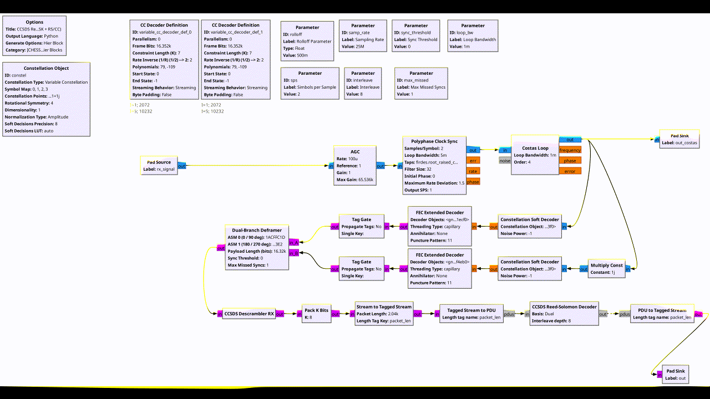
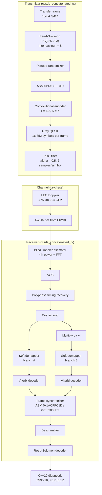
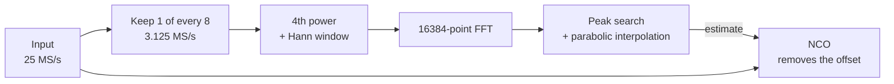
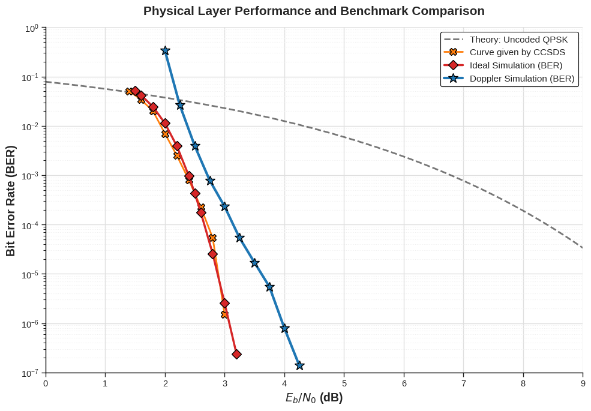
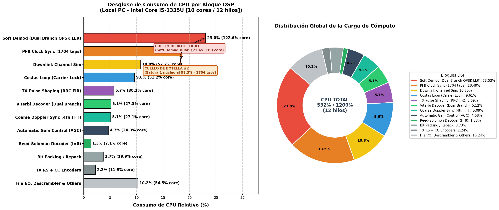

# CCSDS X-Band Telemetry Transceiver in GNU Radio

<p align="center">
  
</p>

[](https://public.ccsds.org/Pubs/131x0b5.pdf)
[](https://www.gnuradio.org/)
[](LICENSE)

Transmitter, LEO channel model and receiver for an X-band (8.4 GHz) telemetry downlink, following the concatenated coding of CCSDS 131.0-B-5: Reed-Solomon plus a convolutional code, with QPSK. The receiver copes with Doppler and with the QPSK phase ambiguity without orbit predictions (TLEs).

This is my bachelor's thesis, developed for the CHESS CubeSat mission (Pathfinder 0) with the EPFL Spacecraft Team and the Telecommunications Circuits Laboratory (TCL). The GNU Radio blocks I wrote for it are in a separate module, [gr-chess](https://github.com/DANIEL-PEREIRA-RIQUELME/gr-chess).

All results below come from simulation: synthetic CCSDS frames through a modelled channel. The receiver has not been tested on a real satellite signal.

## Architecture

<p align="center">
  
</p>

The transmitter and the receiver are GNU Radio hierarchical blocks (`flowgraphs/hier_blocks/`).



## Blind Doppler estimation

At 8.4 GHz the carrier offset seen from the ground is up to about ±250 kHz from orbital Doppler, drifting at roughly 2.5 kHz/s near zenith, plus a few tens of kHz from oscillator offsets. A Costas loop needs a narrow bandwidth to keep phase jitter low, so it only pulls in a few kHz. A coarse stage in front of it removes most of the offset. I use the M-th power method, which needs no knowledge of the orbit:



For a QPSK symbol s = e^{j(2m+1)π/4}, raising to the 4th power gives s⁴ = −1 whatever the data, so the modulation disappears and the signal becomes a single tone at four times the carrier offset:

$$f_{\text{tone}} = 4\,\Delta f_D$$

With pulse shaping the cancellation is not perfect, but the tone is still there and its position is all the estimator needs. The FFT collects the tone energy in one bin (about 42 dB of integration gain for 16384 points), and a parabolic fit around the peak refines the position within the bin. Dividing by four gives the carrier offset, whose bin width is

$$\Delta f_{\text{bin}} = \frac{f_s / D}{4\,N_{\text{FFT}}} = \frac{3.125\ \text{MHz}}{4 \times 16384} \approx 47.7\ \text{Hz}.$$

An estimate is produced every 131,072 samples (5.2 ms) and smoothed with a first-order filter. Known limitations: the decimation has no anti-aliasing filter, and I have not measured the estimation error versus Eb/N0. Details and parameters are in [docs/Blind_Doppler_Estimation_Mth_Power_FFT_CCSDS.md](docs/Blind_Doppler_Estimation_Mth_Power_FFT_CCSDS.md).

## Frame synchronization

A Costas loop on QPSK locks with a phase that is ambiguous by a multiple of 90°. The receiver decodes the Costas output twice, directly and rotated by +j, and gives both streams to one synchronizer (`chess.fast_sync`).

<p align="center">
  
</p>

The synchronizer looks for the ASM `0x1ACFFC1D` and its inverse `0xE53003E2` in both streams and locks to the first match. That covers the four phase ambiguities. While locked it expects an ASM every frame and only goes back to searching after several consecutive misses. It stays on the branch it locked to, so it resolves the ambiguity but does not prevent Costas cycle slips.

## Link parameters

| Parameter | Value |
| :--- | :--- |
| Carrier | 8.4 GHz |
| Modulation | QPSK, Gray-coded, RRC α = 0.5 |
| Sample rate / symbol rate | 25 MS/s / 12.5 MBd |
| Raw channel rate | 25 Mbps |
| Net telemetry rate | ≈ 10.9 Mbps |
| Outer code | RS(255,223), t = 16, I = 8 (1,784 bytes per frame) |
| Inner code | Convolutional r = 1/2, K = 7, (171, 133) octal |
| Randomizer | h(x) = x⁸ + x⁷ + x⁵ + x³ + 1 |
| Attached sync marker | `0x1ACFFC1D` |
| Orbit | 475 km, sun-synchronous, i = 98° |
| Doppler | ±250 kHz, up to 2.5 kHz/s |

## Results

### Bit error rate

<p align="center">
  
</p>

The plot compares uncoded QPSK, the reference curve for this concatenated code from the CCSDS Green Book 130.1-G, and two simulations: static AWGN, and AWGN with the Doppler profile above using the blind estimator and the Costas loop.

- Static AWGN follows the CCSDS curve, with BER ≈ 2.4·10⁻⁷ at Eb/N0 = 3.2 dB.
- With Doppler the waterfall is shifted by about 0.8 dB and BER drops below 10⁻⁶ at 4.0 dB.

### CPU load

Real-time throughput is limited by the CPU, not by the algorithms. On an Intel Core i5-1335U the flowgraph sustains 14.5 Mbps, below the 25 Mbps channel rate. The heaviest blocks are the soft QPSK demapper (about 123 % of one core) and the polyphase clock synchronizer (about 99 %, from a 32-phase filter bank of 53 taps each). The same bottleneck appears on Azure VMs (AMD EPYC 7763). See [docs/CPU_BREAKDOWN_METRICS.md](docs/CPU_BREAKDOWN_METRICS.md).

<p align="center">
  
</p>

## Installation

Developed and run on Ubuntu 24.04 (GNU Radio 3.10, GCC 13). It needs GNU Radio 3.10 or later and a C++20 compiler.

```bash
sudo apt update
sudo apt install -y gnuradio gnuradio-dev cmake g++ git \
                    python3-numpy python3-scipy python3-matplotlib \
                    pybind11-dev libfmt-dev libspdlog-dev libvolk-dev
```

Three out-of-tree modules are needed. Build each with `mkdir build && cd build && cmake .. && make -j$(nproc) && sudo make install && sudo ldconfig`.

| Module | Used for |
| :--- | :--- |
| [gr-chess](https://github.com/DANIEL-PEREIRA-RIQUELME/gr-chess) | Doppler estimator, channel model, frame synchronizer |
| [gr-HighDataRate_Modem](https://github.com/DavidToddMiller/gr-HighDataRate_Modem) | Soft demapper, Viterbi decoder, timing recovery |
| [gr-satellites](https://github.com/daniestevez/gr-satellites) | Scrambler and Reed-Solomon blocks |

Then compile the hierarchical blocks:

```bash
cd flowgraphs/hier_blocks
grcc -u ccsds_concatenated_tx.grc
grcc -u ccsds_concatenated_rx.grc
```

## Usage

Use the system Python, not a Conda one, so that GNU Radio and the installed modules are found.

```bash
# One simulation at Eb/N0 = 3.5 dB on the 60,000-frame vector (generated if missing)
python3 main_transceiver_simulation.py --ebn0 3.50

# Quick run on the 1,000-frame vector included in the repository
python3 main_transceiver_simulation.py --ebn0 4.0 --signal 0.001Ms

# Several Eb/N0 points, one after another
python3 scripts/batch_runner_local.py
```

Each run writes `output/results/test/result_point_<Eb/N0>.json` and a text report with FER and BER. FER counts frames that were lost or failed the CRC. "System BER" adds a 50 % bit error penalty for every such frame; "Sync BER" only counts bit errors inside frames received with a valid CRC. Frames lost while the receiver acquires at the start of the file are included, so short vectors show a higher FER than long ones.

Other tools:

```bash
python3 scripts/generate_test_frames.py --frames 10000 --output data/custom_test_frames.bin
g++ -O3 -std=c++20 scripts/diagnostic.cpp -o scripts/diagnostic    # frame analyzer, built automatically when needed
```

## Repository layout

```
main_transceiver_simulation.py   simulation entry point
flowgraphs/                      GRC flowgraph (GUI) and hierarchical blocks
scripts/                         run_point.py (headless runner), diagnostic.cpp, batch runners,
                                 plotting and CPU profiling
data/                            ASM file and the 1,000-frame test vector
docs/                            Doppler estimator note, CPU profiling and figures
```

## License and acknowledgements

GPL-3.0, see [LICENSE](LICENSE). Developed with the EPFL Spacecraft Team and the TCL at EPFL for the CHESS CubeSat mission.
