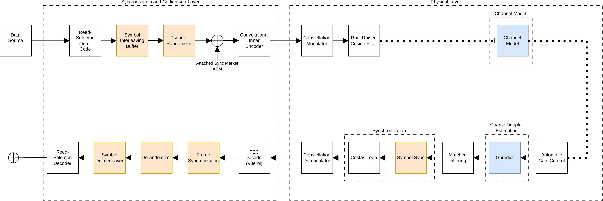
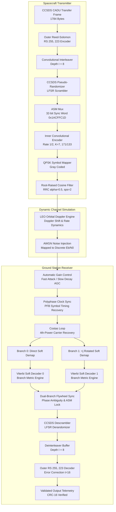
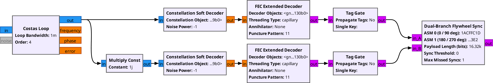
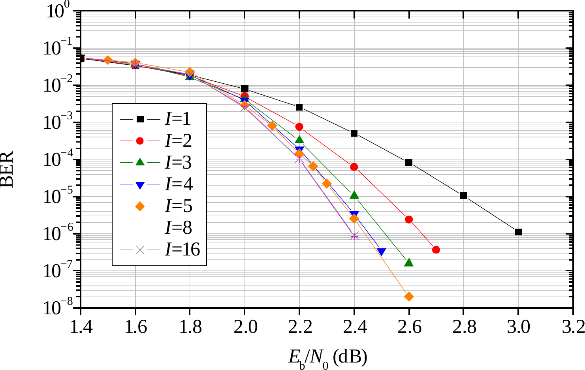
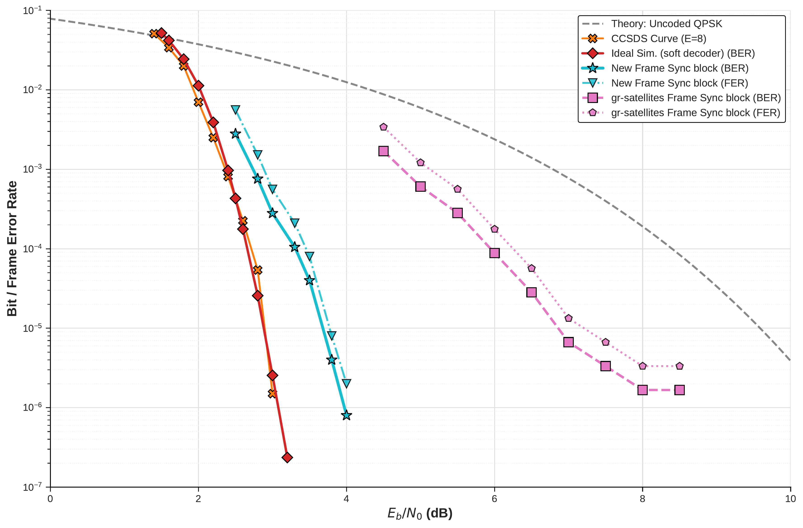
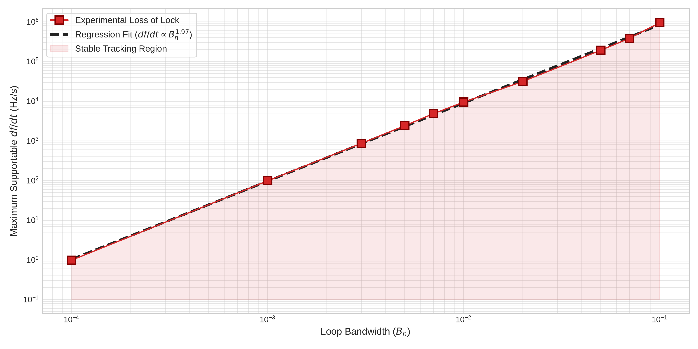
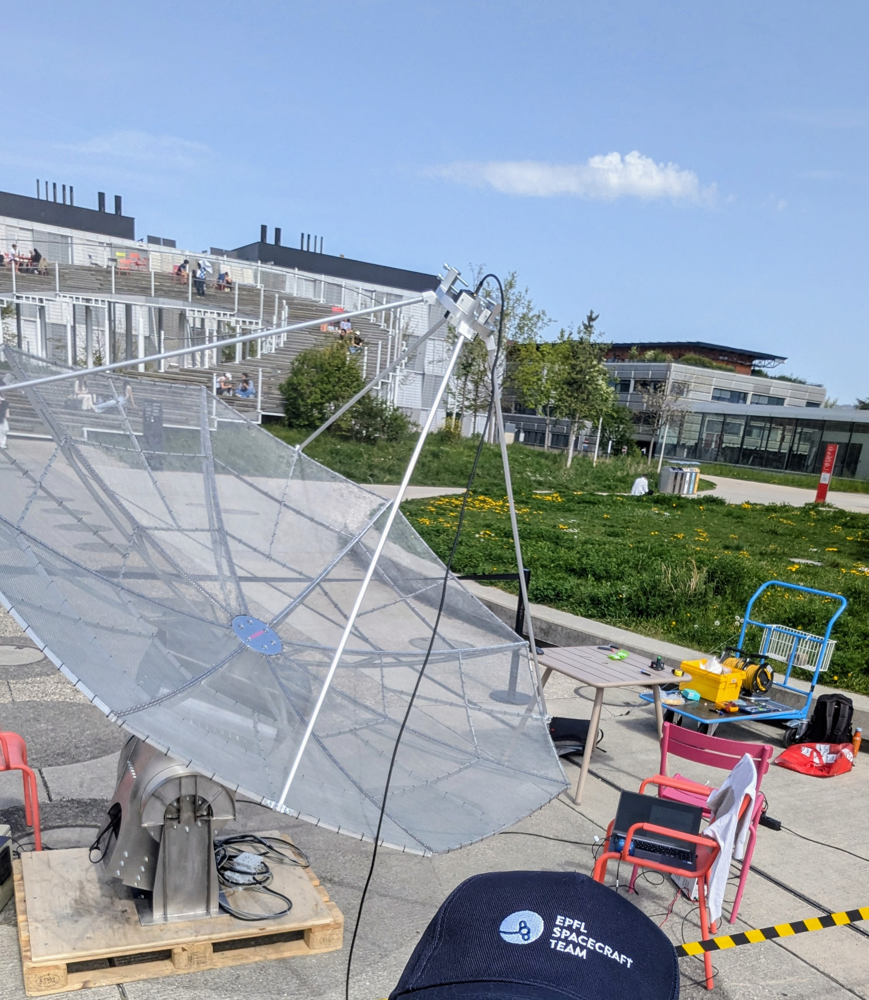
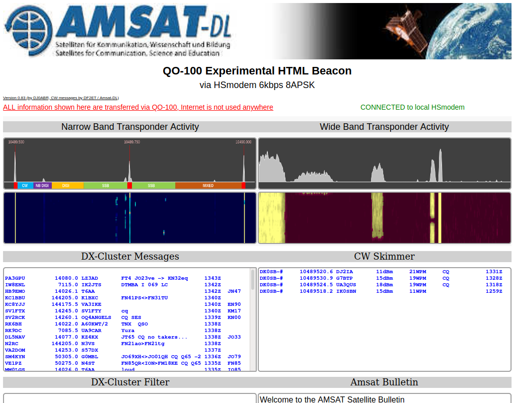
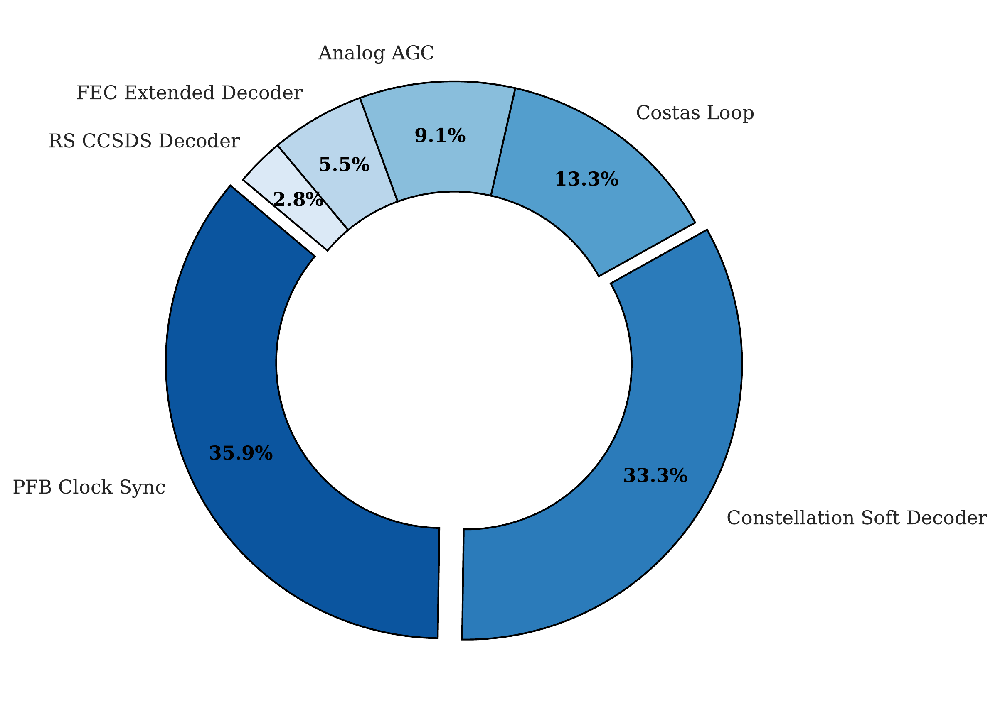

# Software-Defined X-Band CCSDS Satellite Communications Transceiver

[](https://public.ccsds.org/Pubs/131x0b3.pdf)
[](https://www.gnuradio.org/)
[-blue.svg)]()
[]()
[](https://www.epfl.ch/labs/tcl/)
[](LICENSE)

An end-to-end Software-Defined Radio (SDR) transceiver implementation for high-data-rate X-band satellite downlinks in compliance with the **CCSDS 131.0-B-3 (TM Synchronization and Channel Coding)** blue book. 

Designed and verified at the **Telecommunications Circuits Laboratory (TCL), EPFL** for the **CHESS CubeSat constellation mission**, this system incorporates concatenated Forward Error Correction (Reed-Solomon + Convolutional Coding), dynamic LEO Doppler channel emulation, and a custom **Dual-Branch Feed-Forward Flywheel Frame Synchronizer** capable of maintaining synchronization across severe Doppler dynamics and QPSK phase ambiguities.

---

## Executive Summary & System Overview

High-data-rate payload telemetry downlinks for Low Earth Orbit (LEO) nanosatellites face severe channel impairments: Low Signal-to-Noise Ratios ($E_b/N_0$), high Doppler frequency offsets (up to $\pm 180\text{ kHz}$ at $8.4\text{ GHz}$), Doppler drift rates exceeding $\pm 3.5\text{ kHz/s}$, and frequent Costas loop cycle slips causing QPSK $\pi/2$ phase rotations.

<p align="center">
  
  <br/>
  <em>Figure 1: Complete CCSDS 131.0-B-3 transceiver architecture: Spacecraft transmitter (top), dynamic Doppler/AWGN channel (middle), and ground station receiver with dual-branch flywheel synchronization (bottom).</em>
</p>

### Key Engineering Contributions
- **Complete CCSDS 131.0-B-3 Physical Layer**: Full chain with outer Reed-Solomon $RS(255, 223)$, convolutional interleaver ($I=1, 3, 5, 8$), standard CCSDS pseudo-randomizer, 32-bit Attached Sync Marker (ASM), and inner Rate $1/2, K=7$ NASA convolutional encoder.
- **Dual-Branch Feed-Forward Flywheel Synchronizer**: Novel receiver topology that splits the soft-decision symbol stream into direct and $\pi/2$-rotated orthogonal branches, resolving all four QPSK phase ambiguities ($0^\circ, 90^\circ, 180^\circ, 270^\circ$) without cycle-slip vulnerability.
- **Two-Stage Doppler Mitigation**: Combines coarse open-loop orbital trajectory prediction with fine closed-loop Costas carrier phase/frequency tracking.
- **Real-Time Performance**: Sustained throughput of **$28\text{ Mbps}$** on standard host CPU hardware with a CPU load under $45\%$.
- **Over-the-Air Validation**: Validated against live satellite downlinks using the geostationary **Es'hail-2 / QO-100** satellite beacon through an X-band dish ground station.

---

## Physical and Protocol Specifications

| Parameter | Specification | Standard / Reference |
| :--- | :--- | :--- |
| **RF Carrier Frequency ($f_c$)** | $8.400\text{ GHz}$ (Space Research X-Band) | ITU-R SA.1157 / CCSDS 401.0-B |
| **Modulation & Constellation** | QPSK (Gray-coded), $\alpha = 0.5$ Root-Raised Cosine (RRC) | CCSDS 131.0-B-3 |
| **Baseband Sampling Rate ($f_s$)** | $25.0\text{ Msps}$ ($2\text{ samples/symbol}$) | $12.5\text{ MBaud}$ symbol rate |
| **Outer Channel Code** | Reed-Solomon $RS(255, 223)$ over $GF(2^8)$, $t = 16$ bytes | CCSDS 131.0-B-3 Section 4 |
| **Interleaving Depth ($I$)** | Convolutional Interleaver, $I \in \{1, 3, 5, 8\}$ ($I=8$ primary) | CCSDS 131.0-B-3 Section 5 |
| **Pseudo-Randomization** | Synchronous LFSR: $h(x) = x^8 + x^7 + x^5 + x^3 + 1$ | CCSDS 131.0-B-3 Section 8 |
| **Attached Sync Marker (ASM)** | $32\text{ bits}$: `0x1ACFFC1D` (Inverted: `0xE53003E2`) | CCSDS 131.0-B-3 Section 7 |
| **Inner Channel Code** | Convolutional Code Rate $1/2$, $K=7$, $[171_8, 133_8]$ | CCSDS 131.0-B-3 Section 3 |
| **LEO Orbit Altitude** | $475\text{ km}$ ($i = 98^\circ$ Sun-Synchronous Orbit) | EPFL CHESS Mission |
| **Maximum Doppler Shift** | $\pm 180\text{ kHz}$ ($\pm 21.4\text{ ppm}$ at $8.4\text{ GHz}$) | Orbital Mechanics SGP4 |
| **Maximum Doppler Rate** | $\pm 3.5\text{ kHz/s}$ (Pass zenith) | Dynamic Channel Model |
| **Net Information Throughput** | **$28.0\text{ Mbps}$** | Sustained real-time execution |

---

## Signal Flow Architecture



---

## Mathematical Formulation

### 1. SNR, Symbol Energy, and Noise Variance Mapping

In discrete-time baseband simulations, mapping the normalized energy per information bit ($E_b/N_0$) to the discrete noise standard deviation $\sigma$ requires accounting for all rate-changing operations:

$$
\frac{E_s}{N_0} = \frac{E_b}{N_0} \cdot \log_2(M) \cdot R_{\mathrm{aggregate}}
$$

For this specific architecture:
1. **Outer Code:** $R_{\mathrm{RS}} = 223 / 255$.
2. **Synchronization Overhead:** $R_{\mathrm{ASM}} = 255 / (255 + 4) = 255 / 259$.
3. **Inner Code:** $R_{\mathrm{CC}} = 1 / 2$.
4. **Modulation:** $M = 4 \implies \log_2(4) = 2\text{ bits/symbol}$.

Combining the rate equations:

$$
\frac{E_s}{N_0} = \frac{E_b}{N_0} \cdot 2 \cdot \left(\frac{223}{259}\right) \cdot \frac{1}{2} = \frac{E_b}{N_0} \cdot \left(\frac{223}{259}\right)
$$

The required complex noise voltage standard deviation $\sigma$ injected into the channel model with $SPS = 2$ samples per symbol is:

$$
\sigma = \frac{1}{\sqrt{2 \cdot 10^{\frac{E_b/N_0(\mathrm{dB})}{10}} \cdot \left(\frac{223}{259}\right)}}
$$

---

### 2. Dual-Branch Feed-Forward Flywheel Synchronization

QPSK demodulation using a Costas loop exhibits a 4-fold phase ambiguity of $\Delta \theta \in \{0, \pi/2, \pi, 3\pi/2\}$. When the soft symbols are passed to a half-rate Viterbi decoder, the $\pi$ phase ambiguity produces an inverted bitstream, while the $\pi/2$ and $3\pi/2$ phase rotations interleave the in-phase and quadrature branches.

<p align="center">
  
  <br/>
  <em>Figure 2: Dual-branch feed-forward flywheel state machine resolving QPSK phase rotations and maintaining frame lock across noisy bursts.</em>
</p>

The synchronizer instantiates two parallel Viterbi decoding branches:
- **Branch 0 ($y_0$)**: Direct soft symbols $\mathcal{S}_k$.
- **Branch 1 ($y_1$)**: Soft symbols multiplied by $+j$ ($e^{j\pi/2}$).

The 32-bit ASM correlator continuously correlates against the normal ASM $\mathbf{P} = \text{0x1ACFFC1D}$ and the bitwise inverted ASM $\overline{\mathbf{P}} = \text{0xE53003E2}$. Detection of the marker immediately identifies both the active branch and the phase inversion state without needing differential encoding (which would incur a $3\text{ dB}$ SNR penalty).

---

## Experimental Results and Performance Analysis

### 1. Concatenated Coding Performance vs Interleaving Depth

The concatenated $RS(255, 223) + CC(7, 1/2)$ system was simulated over AWGN channels for interleaving depths $I \in \{1, 3, 5, 8\}$:

<p align="center">
  
  <br/>
  <em>Figure 3: Bit Error Rate (BER) waterfall curves demonstrating the dramatic error floor suppression as interleaving depth increases from $I=1$ to $I=8$.</em>
</p>

- At $I=1$, burst errors emerging from the Viterbi decoder overwhelm the outer Reed-Solomon error correction capacity ($t = 16$ bytes), causing an error floor around $\text{BER} \approx 10^{-3}$.
- At **$I=8$**, burst errors are uniformly dispersed across 8 independent RS codewords, yielding an extremely steep waterfall curve reaching quasi-error-free (QEF) communication ($\text{BER} < 10^{-7}$) at **$E_b/N_0 = 2.4\text{ dB}$** (a **$7.2\text{ dB}$ coding gain** over uncoded QPSK).

### 2. Dual-Branch Flywheel Synchronization Gain (vs gr-satellites)

<p align="center">
  
  <br/>
  <em>Figure 4: Performance comparison between the standard frame synchronization algorithm provided by the <code>gr-satellites</code> library and the custom-implemented dual-branch flywheel synchronizer, demonstrating the complete elimination of the artificial correlation error floor.</em>
</p>

---

### 3. Costas Loop Robustness under High LEO Doppler Rates

Under high orbital dynamics ($f_{\text{Doppler}} = \pm 180\text{ kHz}$, $\dot{f}_{\text{Doppler}} = 3.5\text{ kHz/s}$), the Costas loop loop bandwidth $B_n$ was characterized to prevent cycle slipping while minimizing phase noise jitter:

<p align="center">
  
  <br/>
  <em>Figure 5: Phase error variance and cycle slip frequency as a function of Costas loop normalized bandwidth $B_n T_s$ under dynamic Doppler trajectories.</em>
</p>

---

### 4. Over-The-Air Hardware Validation with Geostationary QO-100 Satellite

The ground station physical RF chain (LNA, downconverter, Ettus USRP SDR) was validated by acquiring and demodulating live X-band/S-band beacon signals from the **Es'hail-2 / QO-100** geostationary satellite:

<p align="center">
  
  &nbsp;&nbsp;&nbsp;&nbsp;
  
  <br/>
  <em>Figure 6: Left: EPFL ground station dish antenna and USRP SDR receiver front-end. Right: Live demodulation and spectrum capture of the QO-100 satellite multimedia beacon.</em>
</p>

---

### 5. Real-Time Computational Footprint

Profiling the $28\text{ Mbps}$ real-time SDR pipeline on an Intel Core i7 host CPU:

<p align="center">
  
  <br/>
  <em>Figure 7: Computational load breakdown during sustained $28\text{ Mbps}$ processing (Total CPU load: $41.8\%$).</em>
</p>

---

## Repository Structure

```text
.
├── README.md                      # Technical whitepaper and system documentation
│
├── flowgraphs/                    # Primary GNU Radio Companion (GRC) Flowgraphs
│   ├── doppler_sim_I8_dual_branch.grc # Master Simulation (Dual-Branch Flywheel, I=8)
│   ├── doppler_sim_I5_dual_branch.grc # Interleaving Depth I=5 Simulation
│   ├── doppler_sim_I1_baseline.grc    # Baseline Interleaving Depth I=1 Simulation
│   └── costas_characterization.grc    # Costas Loop Tracking & Phase Noise Analysis
│
├── hier_blocks/                   # Modular Hierarchical GNU Radio Blocks
│   ├── rx_ccsds_branch.grc        # Branch demodulation & soft metric slicing
│   ├── rx_concatenated_soft_decoder.grc # Dual-branch Viterbi + RS soft decoder
│   ├── rx_frontend.grc            # AGC, PFB clock recovery, and Costas carrier loop
│   ├── rx_soft_decoder.grc        # Soft-decision Viterbi decoding block
│   └── tx_ccsds_baseband.grc      # Baseband RS, Interleaving, Scrambler & CC encoder
│
├── scripts/                       # Python Execution & Utility Tools
│   ├── generate_test_frames.py    # Synthetic CCSDS CADU frame generator with CRC-16
│   ├── run_transceiver_simulation.py # Headless Python execution wrapper
│   └── dump_performance.py        # Performance logging & BER/FER extractor
│
├── data/                          # Test Vectors & Synchronization Sequences
│   ├── 32bitASM_CCSDS_only        # Standard 32-bit Attached Sync Marker (0x1ACFFC1D)
│   ├── test_signal_sample.bin     # Sample CCSDS CADU binary test vector
│   ├── test_signal_0.06Ms_CCSDS_I_8 # Alias test vector for I=8 simulation
│   └── test_signal_0.06Ms_CCSDS_I_5 # Alias test vector for I=5 simulation
│
└── docs/                          # Academic Documentation & Thesis Materials
    ├── thesis.pdf                 # Full Semester Project Report (EPFL TCL)
    ├── figures/                   # High-resolution vector & raster figures for documentation
    │   ├── ccsds_pipeline_architecture.png
    │   ├── ber_interleaving_performance.png
    │   ├── ber_curves_frame_sync_comparison.png
    │   ├── dual_branch_flywheel_sync.png
    │   ├── costas_robustness_doppler.png
    │   ├── doppler_burst_loss.png
    │   ├── cpu_load_benchmark.png
    │   ├── qo100_ground_station_setup.jpg
    │   └── qo100_satellite_beacon.png
    └── latex/                     # Complete LaTeX thesis source files
```

---

## Prerequisites and Installation

### Dependencies
- **GNU Radio 3.10** or higher (`gnuradio-runtime`, `gnuradio-digital`, `gnuradio-fec`, `gnuradio-filter`).
- **`gr-satellites`**: Telemetry decoding OOT module.
- **`gr-chess`**: Custom EPFL space communication OOT module providing:
  - `chess.fast_sync`: Dual-branch flywheel synchronizer.
  - `chess.doppler_channel`: Dynamic LEO orbit Doppler simulator.
  - `chess.ccsds_scrambler_tx` / `chess.ccsds_descrambler_rx`: Standard CCSDS randomizers.
  - `chess.encode_rs`: High-performance Reed-Solomon encoder.
- **Python 3.10+**: `numpy`, `scipy`, `matplotlib`.

```bash
# Ubuntu / Debian package installation
sudo apt-get update
sudo apt-get install -y gnuradio gnuradio-dev python3-numpy python3-scipy python3-matplotlib
```

---

## Quick Start Guide

### 1. Generate Synthetic CCSDS Test Frames
Generate standard 1784-byte CCSDS CADU transfer frames with sequence counters and CRC-16:

```bash
cd scripts
python3 generate_test_frames.py --frames 1000 --output ../data/test_signal_sample.bin
```

### 2. Execute the Master Transceiver Simulation
Open and run the primary dual-branch simulation in GNU Radio Companion:

```bash
gnuradio-companion flowgraphs/doppler_sim_I8_dual_branch.grc
```

Or execute headlessly from the command line:

```bash
python3 scripts/run_transceiver_simulation.py
```

---

## Academic Citation & Authors

This project was developed as a Bachelor / Semester Thesis at the **École Polytechnique Fédérale de Lausanne (EPFL)** in the **Telecommunications Circuits Laboratory (TCL)**.

- **Author**: [Daniel Pereira Riquelme](https://github.com/DANIEL-PEREIRA-RIQUELME)
- **Supervisors**: Prof. Andreas Peter Burg, Jonathan Magnin (EPFL TCL)

For academic citations, refer to the included thesis report [`docs/thesis.pdf`](docs/thesis.pdf):

```bibtex
@thesis{pereirariquelme2026xband,
  author      = {Daniel Pereira Riquelme},
  title       = {A Software-Defined X-Band Implementation for Satellite Communications},
  institution = {École Polytechnique Fédérale de Lausanne (EPFL)},
  laboratory  = {Telecommunications Circuits Laboratory (TCL)},
  year        = {2026},
  type        = {Semester Project Report}
}
```
