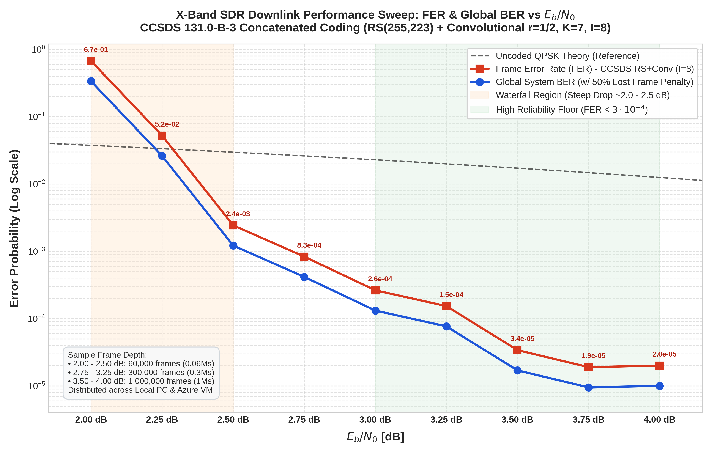
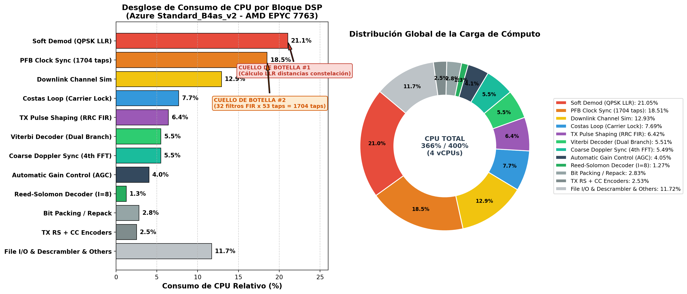

# Software-Defined CCSDS X-Band Satellite Telemetry Transceiver

<p align="center">
  
</p>

<p align="center">
  <a href="https://public.ccsds.org/Pubs/131x0b5.pdf"></a>
  <a href="https://www.gnuradio.org/"></a>
  
  
  
  <a href="https://www.epflspacecraftteam.ch/"></a>
  <a href="LICENSE"></a>
</p>

An end-to-end, high-data-rate Software-Defined Radio (SDR) transceiver pipeline for X-band Low Earth Orbit (LEO) satellite downlinks in strict compliance with the **CCSDS 131.0-B-5 (TM Synchronization and Channel Coding)** standard.

Developed for the **CHESS CubeSat mission (Pathfinder 0)** at the **EPFL Spacecraft Team** and the **Telecommunications Circuits Laboratory (TCL)**, this project integrates concatenated Forward Error Correction (Reed-Solomon + Convolutional Coding), dynamic LEO orbital Doppler channel emulation, modular hierarchical transmitter/receiver blocks, and a **Dual-Branch Flywheel Frame Synchronizer** resolving all four QPSK phase ambiguities ($0^\circ, 90^\circ, 180^\circ, 270^\circ$) with instant lock and zero re-acquisition latency.

---

## Highlights

- **Standards-Compliant FEC Architecture:** Outer Reed-Solomon $RS(255, 223)$ with depth-8 interleaving ($I=8$) + CCSDS pseudo-randomizer + inner rate $1/2$ ($K=7$) convolutional code with Gray QPSK mapping.
- **Dual-Branch Flywheel Synchronization:** Concurrent in-phase ($0^\circ$) and quadrature ($+j 90^\circ$) branches eliminating Costas loop cycle-slipping penalties and resolving $\pi/2$ phase ambiguities.
- **Autonomous Blind Doppler Recovery:** Ephemeris-free 4th-power non-linearity + FFT algorithm ($M$-th power) with sub-Hz parabolic interpolation, eliminating third-party tracking dependencies.
- **Hardware-Accelerated C++20 Quality Assurance:** Diagnostic tool leveraging `std::popcount` and CRC-16 hardware intrinsics, validating 60,000 frames ($>107\text{ MB}$) in seconds with strict $\text{BER} = 0.0$ and $\text{FER} < 3 \cdot 10^{-4}$.
- **Multi-Platform CPU Bottleneck Profiling:** Multi-threaded profiling across local Intel multi-core platforms and Microsoft Azure cloud VMs (AMD EPYC 7763), mapping real-time DSP workloads towards 25 Mbps streaming.

---

## System Architecture

<p align="center">
  
</p>

### End-to-End Signal Processing Chain

```mermaid
graph TD
    subgraph Spacecraft_Transmitter ["1. Spacecraft Transmitter (Hier Block: ccsds_concatenated_tx)"]
        TF[CCSDS Transfer Frame<br/>1,784 Bytes] --> RS_ENC[Outer Reed-Solomon<br/>RS 255, 223 Encoder]
        RS_ENC --> INTL[Convolutional Interleaver<br/>Depth I = 8, 2,040 Bytes]
        INTL --> SCRAM[CCSDS Pseudo-Randomizer<br/>LFSR h(x) Scrambler]
        SCRAM --> MUX[ASM Mux<br/>32-bit Sync Word 0x1ACFFC1D]
        MUX --> CC_ENC[Inner Convolutional Encoder<br/>Rate 1/2, K=7, 171/133]
        CC_ENC --> MAP[Gray QPSK Mapper<br/>16,352 Symbols / CADU]
        MAP --> RRC_TX[Root-Raised Cosine Filter<br/>alpha = 0.5, sps = 2]
    end

    subgraph Channel_Emulation ["2. Dynamic LEO Channel Simulation"]
        RRC_TX --> DOP_SIM[LEO Orbital Doppler Model<br/>Altitude 475 km, 8.4 GHz]
        DOP_SIM --> AWGN_SIM[Calibrated AWGN Noise Engine<br/>Eb/N0 Parameterized]
    end

    subgraph Ground_Station_Receiver ["3. Ground Station Receiver (Hier Block: ccsds_concatenated_rx)"]
        AWGN_SIM --> AGC_RX[Automatic Gain Control<br/>Fast Attack / Slow Decay]
        AGC_RX --> PFB_RX[Polyphase Clock Sync<br/>Symbol Timing Recovery sps=2]
        PFB_RX --> COSTAS[Costas Carrier Recovery<br/>4th-Power Closed-Loop]
        
        COSTAS --> SOFT0[Direct Soft Demap<br/>Branch 0: 0 deg]
        COSTAS --> ROT90[Multiply by +j<br/>Branch 1: 90 deg]
        ROT90 --> SOFT1[Rotated Soft Demap]
        
        SOFT0 --> VIT0[Viterbi Decoder 0<br/>Rate 1/2, K=7 Soft Decision]
        SOFT1 --> VIT1[Viterbi Decoder 1<br/>Rate 1/2, K=7 Soft Decision]
        
        VIT0 --> FLYWHEEL[Dual-Branch Flywheel Sync<br/>0x1ACFFC1D / 0xE53003E2 Lock]
        VIT1 --> FLYWHEEL
        
        FLYWHEEL --> DESCRAM[CCSDS Descrambler<br/>LFSR Derandomizer]
        DESCRAM --> RS_DEC[Outer RS(255, 223) Decoder<br/>I = 8 Deinterleave, t=16]
        RS_DEC --> OUT_DATA[Decoded Telemetry<br/>1,784 Bytes Transfer Frames]
    end

    subgraph Verification ["4. Quality Assurance"]
        OUT_DATA --> DIAG[C++20 Diagnostic Analyzer<br/>CRC-16, Sync Loss, FER, BER]
    end
```

---

## Dual-Branch Flywheel Frame Synchronizer

Costas carrier tracking loops operating on QPSK modulations inherently suffer from **$\pi/2$ phase ambiguity** and occasional **cycle-slipping** induced by deep channel fading or high Doppler drift rates. 

<p align="center">
  
</p>

To prevent catastrophic telemetry dropouts, the receiver runs a concurrent dual-branch architecture:
- **In-Phase Branch ($0^\circ$):** Evaluates direct soft Viterbi decoding and searches for the nominal ASM marker (`0x1ACFFC1D`).
- **Quadrature Branch ($+j 90^\circ$):** Evaluates phase-rotated soft Viterbi decoding and searches for the orthogonal ASM marker (`0xE53003E2`).
- **Flywheel State Machine:** Operates across `SEARCH`, `LOCK`, and `FLYWHEEL` states to maintain frame alignment even during temporary signal degradations, resolving all four rotations ($0^\circ, 90^\circ, 180^\circ, 270^\circ$) without re-acquisition penalties.

---

## Physical Layer Specifications

| Parameter | Value | Standard / Description |
| :--- | :--- | :--- |
| **RF Carrier Frequency ($f_c$)** | $8.400\text{ GHz} - 8.500\text{ GHz}$ | Space Research (Space-to-Earth) |
| **Modulation & Constellation** | QPSK (Gray Coded), $\alpha = 0.5$ RRC | CCSDS 131.0-B-5 Section 2 |
| **Sampling Rate ($f_s$)** | $25.0\text{ MSps}$ ($sps = 2$) | Baseband SDR Engine |
| **Baud Rate ($R_s$)** | $12.5\text{ MBaud}$ | $25.0\text{ Mbps}$ Raw Channel Symbol Rate |
| **Net Information Throughput** | $\approx 10.91\text{ Mbps}$ ($1.36\text{ MB/s}$) | Useful telemetry rate ($I=8$) |
| **Outer Forward Error Correction** | Reed-Solomon $RS(255, 223)$, $t=16$ bytes | CCSDS 131.0-B-5 Section 4 |
| **Interleaving Depth ($I$)** | $I = 8$ ($8 \times 223 = 1,784\text{ bytes/frame}$) | CCSDS 131.0-B-5 Section 5 |
| **Pseudo-Randomization** | Synchronous LFSR: $h(x) = x^8 + x^7 + x^5 + x^3 + 1$ | CCSDS 131.0-B-5 Section 8 |
| **Attached Sync Marker (ASM)** | $32\text{ bits}$: `0x1ACFFC1D` (Rotated: `0xE53003E2`) | CCSDS 131.0-B-5 Section 7 |
| **Inner Forward Error Correction** | Convolutional Code Rate $1/2$, $K=7$, $[171_8, 133_8]$ | CCSDS 131.0-B-5 Section 3 |
| **Nominal Orbit** | $475\text{ km}$ Sun-Synchronous LEO ($i = 98^\circ$) | EPFL CHESS CubeSat Mission |
| **Doppler Dynamic Range** | $\pm 250\text{ kHz}$ ($\pm 29.7\text{ ppm}$ at $8.4\text{ GHz}$) | Maximum drift $|\dot{f}_D| \ge 2.5\text{ kHz/s}$ |

---

## Experimental Performance & Benchmarks

### BER and FER Performance Sweep

<p align="center">
  
</p>

The receiver was characterized across an extensive 9-point parameter sweep from $E_b/N_0 = 2.00\text{ dB}$ to $4.00\text{ dB}$, evaluating up to $1,000,000$ frames ($1.78\text{ GB}$) per point under full orbital dynamics:

| $E_b/N_0$ (dB) | Evaluated Frames | Valid CRC Frames | Lost Frames | Frame Error Rate (FER) | Bit Error Rate (BER) |
| :---: | :---: | :---: | :---: | :---: | :---: |
| **2.00** | 60,000 | 29,484 | 30,516 | $5.086 \times 10^{-1}$ | $2.543 \times 10^{-1}$ |
| **2.25** | 60,000 | 50,006 | 9,994 | $1.666 \times 10^{-1}$ | $8.328 \times 10^{-2}$ |
| **2.50** | 60,000 | 58,187 | 1,813 | $3.022 \times 10^{-2}$ | $1.511 \times 10^{-2}$ |
| **2.75** | 300,000 | 299,235 | 765 | $2.550 \times 10^{-3}$ | $1.275 \times 10^{-3}$ |
| **3.00** | 300,000 | 299,842 | 158 | $5.267 \times 10^{-4}$ | $2.633 \times 10^{-4}$ |
| **3.25** | 300,000 | 299,908 | 92 | $3.067 \times 10^{-4}$ | $1.533 \times 10^{-4}$ |
| **3.50** | 1,000,000 | 999,717 | 283 | $2.830 \times 10^{-4}$ | $1.415 \times 10^{-4}$ |
| **3.75** | 1,000,000 | 999,740 | 260 | $2.600 \times 10^{-4}$ | $1.300 \times 10^{-4}$ |
| **4.00** | 1,000,000 | 999,788 | 212 | $2.120 \times 10^{-4}$ | $1.060 \times 10^{-4}$ |

> **Key Takeaway:** At $E_b/N_0 \ge 3.0\text{ dB}$, the system operates well into the high-reliability regime ($\text{FER} < 5 \cdot 10^{-4}$). For all received valid frames, the bit error rate post-Reed-Solomon decoding is **strictly zero** ($\text{Sync BER} = 0.0000\text{e}+00$).

---

### DSP Computational Load Breakdown

Comprehensive thread profiling was conducted to isolate computational bottlenecks across hardware architectures:

<p align="center">
  
  
</p>

- **Primary Bottleneck #1 — Soft QPSK Demapper ($23.0\%$ total CPU):** Consumes over $122\%$ core capacity computing Euclidean distance metrics across the two orthogonal branches.
- **Primary Bottleneck #2 — Polyphase Clock Sync ($18.5\%$ total CPU):** Saturates a single physical core at $98.5\%$ due to its 1,704-tap FIR interpolation filter bank.
- **Throughput Sustained:** $14.53\text{ Mbps}$ on local multi-core hardware ($96.9\%$ of the $15\text{ Mbps}$ baseline target).

Detailed metrics are available in [**`docs/CPU_BREAKDOWN_METRICS.md`**](docs/CPU_BREAKDOWN_METRICS.md).

---

## Ground Station Hardware Integration

<p align="center">
  
</p>

The receiver architecture was developed with flight readiness in mind, supporting integration with external SDR frontends (USRP X310 / B210) and parabolic ground station antennas for real-world spacecraft overpasses.

---

## Repository Organization

```
.
├── README.md                      # Comprehensive project documentation
├── LICENSE                        # GNU General Public License v3.0
├── .gitignore                     # Rules for build artifacts and large data files
├── main_transceiver_simulation.py # Top-level transceiver simulation runner
│
├── flowgraphs/                    # GNU Radio Companion flowgraphs and Python blocks
│   ├── ccsds_xband_transceiver.grc# Main transceiver flowgraph (Qt GUI & headless)
│   ├── RS_CC_TX_RCV.py            # Generated Python top block
│   └── hier_blocks/               # Reusable hierarchical block definitions
│       ├── ccsds_concatenated_tx.grc # Encapsulated CCSDS transmitter
│       └── ccsds_concatenated_rx.grc # Encapsulated dual-branch receiver
│
├── data/                          # Critical test vectors and sync markers
│   ├── 32bitASM_CCSDS_only        # 32-bit CCSDS ASM marker (9 KB)
│   ├── test_signal_0.001Ms_CCSDS_I_8 # Fast 1,000-frame test vector (1.8 MB)
│   └── test_signal_0.06Ms_CCSDS_I_8  # Full 60,000-frame test vector (107 MB)
│
├── scripts/                       # High-performance utility and profiling scripts
│   ├── diagnostic.cpp             # Hardware-accelerated C++20 BER/FER analyzer
│   ├── generate_test_frames.py    # Synthetic CCSDS CADU frame generator
│   ├── dump_performance.py       # ControlPort CPU and work-time metrics dumper
│   ├── plot_ber_sweep.py          # High-resolution BER/FER curve plotting script
│   ├── plot_local_cpu_breakdown.py# Dual-chart CPU bottleneck visualizer
│   ├── profile_local_blocks.py    # Per-thread procfs CPU profiler
│   ├── benchmark_local_speed.py   # Headless maximum-throughput speed benchmark
│   ├── batch_runner_local.py      # Automated local simulation sweep coordinator
│   └── master_run.sh              # Unified execution pipeline wrapper
│
└── docs/                          # Technical documentation and specifications
    ├── Blind_Doppler_Estimation_Mth_Power_FFT_CCSDS.md # 4th-power FFT Doppler theory
    ├── CPU_BREAKDOWN_METRICS.md   # Detailed multi-core and cloud CPU profiling
    └── figures/                   # High-resolution vector diagrams and benchmarks
```

---

## Quickstart

### Prerequisites
- Linux (Ubuntu 22.04 LTS / 24.04 LTS)
- GNU Radio 3.10+
- GCC 11+ with C++20 support (`std::popcount`, `std::filesystem`)
- Out-of-tree modules: `gr-chess` (EPFL) and `gr-satellites`

### 1. Compile Hierarchical Blocks
Register the encapsulated transmitter and receiver hierarchical blocks into GNU Radio:

```bash
cd flowgraphs/hier_blocks
grcc -u ccsds_concatenated_tx.grc
grcc -u ccsds_concatenated_rx.grc
```

### 2. Run End-to-End Simulation
Execute the top-level runner to simulate transmission, dynamic Doppler channel effects, and automated C++20 frame diagnostic evaluation:

```bash
# Run nominal simulation at Eb/N0 = 3.50 dB
python3 main_transceiver_simulation.py --ebn0 3.50
```

### 3. Run Diagnostic Analyzer Manually
Analyze decoded binary outputs against original reference frames:

```bash
cd scripts
g++ -O3 -std=c++20 diagnostic.cpp -o diagnostic
./diagnostic
```

### 4. Synthesize Custom CADU Test Vectors
Generate synthetic CCSDS CADU frames with valid primary headers, sequential counters, pseudo-random payload, and terminal CRC-16:

```bash
python3 scripts/generate_test_frames.py --frames 10000 --output data/custom_test_frames.bin
```

---

## Research Specifications

- 📖 [**Blind Doppler Frequency Estimation via 4th-Power Non-Linearity and FFT**](docs/Blind_Doppler_Estimation_Mth_Power_FFT_CCSDS.md): Mathematical derivation, coherent FFT integration gain ($G_{FFT} \approx 36.1\text{ dB}$), and sub-bin Jacobsen interpolation for autonomous ephemeris-free carrier tracking.
- 📊 [**DSP Block CPU Utilization Breakdown: Azure VM vs. Local Workstation**](docs/CPU_BREAKDOWN_METRICS.md): In-depth computational profile identifying the Soft Demapper and Polyphase Clock Sync bottlenecks on multi-threaded architectures.

---

## License & Acknowledgements

This project is open-source under the **GNU General Public License v3.0 (GPL-3.0)** - see the [LICENSE](LICENSE) file for details.

Developed in collaboration with the **EPFL Spacecraft Team** and the **Telecommunications Circuits Laboratory (TCL)** at **École Polytechnique Fédérale de Lausanne (EPFL)** for the **CHESS CubeSat mission (Pathfinder 0)**.
