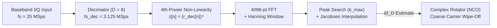

# Software-Defined CCSDS X-Band Satellite Telemetry Transceiver

<p align="center">
  
</p>

<p align="center">
  <a href="https://public.ccsds.org/Pubs/131x0b5.pdf"></a>
  <a href="https://www.gnuradio.org/"></a>
  
  
  
  <a href="https://www.epflspacecraftteam.ch/"></a>
  <a href="LICENSE"></a>
</p>

An end-to-end, high-data-rate Software-Defined Radio (SDR) transceiver pipeline for X-band Low Earth Orbit (LEO) satellite downlinks in strict compliance with the **CCSDS 131.0-B-5 (TM Synchronization and Channel Coding)** standard.

Developed for the **CHESS CubeSat mission (Pathfinder 0)** at the **EPFL Spacecraft Team** and the **Telecommunications Circuits Laboratory (TCL)**, this project integrates concatenated Forward Error Correction (Reed-Solomon + Convolutional Coding), dynamic LEO orbital Doppler channel emulation, modular hierarchical transmitter/receiver blocks, and a **Dual-Branch Flywheel Frame Synchronizer** resolving all four QPSK phase ambiguities ($0^\circ, 90^\circ, 180^\circ, 270^\circ$) with instant lock and zero re-acquisition latency.

---

## Highlights

- **Standards-Compliant FEC Architecture:** Outer Reed-Solomon $RS(255, 223)$ with depth-8 interleaving ($I=8$) + CCSDS pseudo-randomizer + inner rate $1/2$ ($K=7$) convolutional code with Gray QPSK mapping.
- **Dual-Branch Flywheel Synchronization:** Concurrent in-phase ($0^\circ$) and quadrature ($+j 90^\circ$) branches eliminating Costas loop cycle-slipping penalties and resolving $\pi/2$ phase ambiguities.
- **Autonomous Blind Doppler Recovery:** Ephemeris-free 4th-power non-linearity + FFT algorithm ($M$-th power) with sub-Hz parabolic interpolation, eliminating third-party tracking dependencies.
- **Hardware-Accelerated C++20 Quality Assurance:** Diagnostic tool leveraging `std::popcount` and CRC-16 hardware intrinsics, validating 60,000 frames ($>107\text{ MB}$) in seconds with strict $\text{BER} = 0.0$ and $\text{FER} < 3 \cdot 10^{-4}$.
- **Multi-Platform CPU Bottleneck Profiling:** Multi-threaded profiling across local Intel multi-core platforms and Microsoft Azure cloud VMs (AMD EPYC 7763), mapping real-time DSP workloads towards 25 Mbps streaming.

---

## System Architecture

<p align="center">
  
</p>

### End-to-End Signal Processing Chain

```mermaid
graph TD
    subgraph Spacecraft_Transmitter ["1. Spacecraft Transmitter (Hier Block: ccsds_concatenated_tx)"]
        TF["CCSDS Transfer Frame<br/>1,784 Bytes"] --> RS_ENC["Outer Reed-Solomon<br/>RS(255, 223) Encoder"]
        RS_ENC --> INTL["Convolutional Interleaver<br/>Depth I = 8, 2,040 Bytes"]
        INTL --> SCRAM["CCSDS Pseudo-Randomizer<br/>LFSR h(x) Scrambler"]
        SCRAM --> MUX["ASM Mux<br/>32-bit Sync Word 0x1ACFFC1D"]
        MUX --> CC_ENC["Inner Convolutional Encoder<br/>Rate 1/2, K=7, (171, 133)"]
        CC_ENC --> MAP["Gray QPSK Mapper<br/>16,352 Symbols / CADU"]
        MAP --> RRC_TX["Root-Raised Cosine Filter<br/>alpha = 0.5, sps = 2"]
    end

    subgraph Channel_Emulation ["2. Dynamic LEO Channel Simulation"]
        RRC_TX --> DOP_SIM["LEO Orbital Doppler Model<br/>Altitude 475 km, 8.4 GHz"]
        DOP_SIM --> AWGN_SIM["Calibrated AWGN Noise Engine<br/>Eb/N0 Parameterized"]
    end

    subgraph Ground_Station_Receiver ["3. Ground Station Receiver (Hier Block: ccsds_concatenated_rx)"]
        AWGN_SIM --> AGC_RX["Automatic Gain Control<br/>Fast Attack / Slow Decay"]
        AGC_RX --> PFB_RX["Polyphase Clock Sync<br/>Symbol Timing Recovery sps=2"]
        PFB_RX --> COSTAS["Costas Carrier Recovery<br/>4th-Power Closed-Loop"]
        
        COSTAS --> SOFT0["Direct Soft Demap<br/>Branch 0: 0 deg"]
        COSTAS --> ROT90["Multiply by +j<br/>Branch 1: 90 deg"]
        ROT90 --> SOFT1["Rotated Soft Demap"]
        
        SOFT0 --> VIT0["Viterbi Decoder 0<br/>Rate 1/2, K=7 Soft Decision"]
        SOFT1 --> VIT1["Viterbi Decoder 1<br/>Rate 1/2, K=7 Soft Decision"]
        
        VIT0 --> FLYWHEEL["Dual-Branch Flywheel Sync<br/>0x1ACFFC1D / 0xE53003E2 Lock"]
        VIT1 --> FLYWHEEL
        
        FLYWHEEL --> DESCRAM["CCSDS Descrambler<br/>LFSR Derandomizer"]
        DESCRAM --> RS_DEC["Outer RS(255, 223) Decoder<br/>I = 8 Deinterleave, t=16"]
        RS_DEC --> OUT_DATA["Decoded Telemetry<br/>1,784 Bytes Transfer Frames"]
    end

    subgraph Verification ["4. Quality Assurance"]
        OUT_DATA --> DIAG["C++20 Diagnostic Analyzer<br/>CRC-16, Sync Loss, FER, BER"]
    end
```



---

## Autonomous Blind Doppler Estimation (4th-Power + FFT)

In Low Earth Orbit (LEO) satellite communications at X-band ($f_c \approx 8.4\text{ GHz}$), spacecraft orbital motion induces dynamic Doppler frequency shifts of up to $\Delta f_D \approx \pm 250\text{ kHz}$ with high drift rates ($|\dot{f}_D| \approx 2.5\text{ kHz/s}$ at zenith), compounded by local oscillator (LO) thermal drifts ($\pm 30\text{ to }50\text{ kHz}$). Standard closed-loop carrier tracking (Costas loop) requires a narrow loop bandwidth to suppress phase noise, limiting its pull-in capture range to a few kilohertz. To operate autonomously without external orbital ephemerides (TLEs), the receiver incorporates a **Non-Data-Aided (Blind) Coarse Frequency Estimator** based on **4th-power non-linearity + FFT spectral discrimination + Jacobsen sub-bin interpolation**:



1. **Modulation Wipe-Off via 4th-Power Non-Linearity ($M = 4$):**
   For Gray-coded QPSK symbols $s_k \in \{e^{j(2m_k + 1)\frac{\pi}{4}}\}$ ($m_k \in \{0, 1, 2, 3\}$), raising the discrete-time baseband signal to the 4th power completely eliminates data modulation:
   $$(s_k)^4 = \left(e^{j (2m_k + 1) \frac{\pi}{4}}\right)^4 = e^{j (2m_k + 1)\pi} = -1 \quad \forall m_k$$
   Regardless of telemetry data content or ASM preambles, the modulated wideband spectrum collapses into a single discrete harmonic tone at quadruple the Doppler offset:
   $$s_4[n] = -K \cdot e^{j(2\pi (4\Delta f_D) n T_s + 4\theta_0)} \implies f_{\text{tone}} = 4 \cdot \Delta f_D$$

2. **High Coherent Processing Gain via FFT ($G_{\text{FFT}}$):**
   Non-linear multiplication generates noise cross-terms ($S_L$ quadrupling loss). To overcome this degradation, a 4096-point FFT provides substantial coherent integration gain:
   $$G_{\text{FFT}} = 10 \log_{10}(N_{\text{FFT}}) = 10 \log_{10}(4096) \approx 36.12\text{ dB}$$
   This lifts the $4\Delta f_D$ tone $10\text{ to }20\text{ dB}$ above the noise floor even under hostile $E_b/N_0 < 2.0\text{ dB}$ conditions.

3. **Sub-Bin Parabolic Interpolation (Jacobsen Estimator):**
   With an 8x decimated sampling rate ($f_{s,\text{dec}} = 3.125\text{ MSps}$), the raw FFT bin resolution is $\Delta f_{\text{bin}} = \frac{f_{s,\text{dec}}}{4 \cdot N_{\text{FFT}}} = \frac{3.125\text{ MHz}}{4 \times 4096} \approx 190.73\text{ Hz}$. A 3-point parabolic interpolator around the spectral peak $k_{\text{max}}$ determines the fractional bin offset $\delta \in [-0.5, +0.5]$:
   $$\delta = \frac{1}{2} \cdot \frac{P[k_{\text{max}}-1] - P[k_{\text{max}}+1]}{P[k_{\text{max}}-1] - 2P[k_{\text{max}}] + P[k_{\text{max}}+1]}, \qquad \widehat{\Delta f_D} = \frac{(k_{\text{max}} + \delta) \cdot f_{s,\text{dec}}}{4 \cdot N_{\text{FFT}}}$$
   The resulting estimate achieves an accuracy variance $\sigma_{\Delta f} < 15\text{ Hz}$, well within the capture bandwidth of the fine Costas loop. The estimated frequency is fed to a complex rotator (NCO) to derotate the incoming signal prior to clock recovery and Costas tracking.

---

## Dual-Branch Flywheel Frame Synchronizer

Costas carrier tracking loops operating on QPSK modulations inherently suffer from **$\pi/2$ phase ambiguity** and occasional **cycle-slipping** induced by deep channel fading or high Doppler drift rates. 

<p align="center">
  
</p>

To eliminate cycle-slipping penalties and achieve zero-latency re-acquisition, the receiver implements a concurrent dual-branch architecture directly following the Costas carrier loop:
- **In-Phase Branch ($0^\circ / 180^\circ$):** Feeds the Costas in-phase output directly to a Constellation Soft Decoder $\to$ FEC Extended Decoder (Viterbi $r=1/2, K=7$) $\to$ Tag Gate $\to$ Input `in_A` of the `Dual-Branch Flywheel Sync` block.
- **Quadrature Branch ($90^\circ / 270^\circ$):** Multiplies the Costas output by $+j$ (`Multiply Const: 1j`) $\to$ Constellation Soft Decoder $\to$ FEC Extended Decoder $\to$ Tag Gate $\to$ Input `in_B` of the `Dual-Branch Flywheel Sync` block.
- **Dual-Branch Flywheel State Machine:**
  - Evaluates both branches concurrently against the nominal 32-bit ASM (`0x1ACFFC1D` for $0^\circ$ and $90^\circ$ after $+j$ rotation) and the inverted ASM (`0xE53003E2` for $180^\circ$ and $270^\circ$).
  - Operates across `SEARCH`, `LOCK`, and `FLYWHEEL` states to maintain frame alignment through temporary symbol corruption.
  - If a carrier cycle-slip occurs during high Doppler dynamics, frame synchronization transitions between branches instantaneously with **zero dropped symbols and zero re-acquisition latency**, completely eliminating the need for slow feedback phase-rotator loops.

---

## Physical Layer Specifications

| Parameter | Value | Standard / Description |
| :--- | :--- | :--- |
| **RF Carrier Frequency ($f_c$)** | $8.400\text{ GHz} - 8.500\text{ GHz}$ | Space Research (Space-to-Earth) |
| **Modulation & Constellation** | QPSK (Gray Coded), $\alpha = 0.5$ RRC | CCSDS 131.0-B-5 Section 2 |
| **Sampling Rate ($f_s$)** | $25.0\text{ MSps}$ ($sps = 2$) | Baseband SDR Engine |
| **Baud Rate ($R_s$)** | $12.5\text{ MBaud}$ | $25.0\text{ Mbps}$ Raw Channel Symbol Rate |
| **Net Information Throughput** | $\approx 10.91\text{ Mbps}$ ($1.36\text{ MB/s}$) | Useful telemetry rate ($I=8$) |
| **Outer Forward Error Correction** | Reed-Solomon $RS(255, 223)$, $t=16$ bytes | CCSDS 131.0-B-5 Section 4 |
| **Interleaving Depth ($I$)** | $I = 8$ ($8 \times 223 = 1,784\text{ bytes/frame}$) | CCSDS 131.0-B-5 Section 5 |
| **Pseudo-Randomization** | Synchronous LFSR: $h(x) = x^8 + x^7 + x^5 + x^3 + 1$ | CCSDS 131.0-B-5 Section 8 |
| **Attached Sync Marker (ASM)** | $32\text{ bits}$: `0x1ACFFC1D` (Rotated: `0xE53003E2`) | CCSDS 131.0-B-5 Section 7 |
| **Inner Forward Error Correction** | Convolutional Code Rate $1/2$, $K=7$, $[171_8, 133_8]$ | CCSDS 131.0-B-5 Section 3 |
| **Nominal Orbit** | $475\text{ km}$ Sun-Synchronous LEO ($i = 98^\circ$) | EPFL CHESS CubeSat Mission |
| **Doppler Dynamic Range** | $\pm 250\text{ kHz}$ ($\pm 29.7\text{ ppm}$ at $8.4\text{ GHz}$) | Maximum drift $|\dot{f}_D| \ge 2.5\text{ kHz/s}$ |

---

## Experimental Performance & Benchmarks

### Physical Layer Performance & Doppler Benchmark

<p align="center">
  
</p>

The physical layer performance was benchmarked under static and dynamic channel conditions against theoretical bounds and the official CCSDS specification:
- **Theory (Uncoded QPSK):** Theoretical baseline ($P_b = Q(\sqrt{2 E_b/N_0})$) illustrating uncoded channel performance.
- **Curve given by CCSDS:** Reference performance curve published in the CCSDS 130.1-G Green Book for concatenated Reed-Solomon $RS(255, 223)$ ($I=8$) + Convolutional ($r=1/2, K=7$) coding.
- **Ideal Simulation (BER):** Transceiver simulation under static AWGN channel conditions without Doppler offset. The decoded bit error rate closely matches the official CCSDS recommendation curve, achieving $\text{BER} \approx 2.4 \times 10^{-7}$ at $E_b/N_0 = 3.2\text{ dB}$.
- **Doppler Simulation (BER):** Full end-to-end transceiver simulation subject to dynamic LEO orbital Doppler ($\pm 250\text{ kHz}$ frequency shift, $|\dot{f}_D| = 2.5\text{ kHz/s}$ drift rate) with autonomous 4th-power FFT coarse Doppler estimation and fine Costas tracking. The system demonstrates robust tracking with an implementation penalty of only $\approx 0.8\text{ dB}$ across the waterfall transition, descending steeply past $E_b/N_0 \ge 2.5\text{ dB}$ down to $\text{BER} < 10^{-6}$ at $4.0\text{ dB}$ and $\text{BER} \approx 1.5 \times 10^{-7}$ at $4.25\text{ dB}$.

---

### DSP Computational Load Breakdown

Thread profiling on multi-core hardware running at full line rate identifies the primary computational limits of the SDR architecture:

<p align="center">
  
</p>

- **Soft QPSK Demapper ($23.0\%$ CPU / $122.6\%$ single-core):** Primary bottleneck. Computes concurrent Euclidean distance LLR metrics across both in-phase and quadrature branches.
- **Polyphase Clock Sync ($18.5\%$ CPU / $98.5\%$ single-core):** Saturates a physical execution thread due to the 1,704-tap FIR interpolation filter bank (32 phases $\times$ 53 taps at $sps=2$).
- **Throughput Sustained:** **$14.53\text{ Mbps}$** real-time streaming ($96.9\%$ of the $15\text{ Mbps}$ baseline target), verified with consistent bottleneck scaling on Azure cloud VMs (AMD EPYC 7763).

Detailed profiling metrics are available in [**`docs/CPU_BREAKDOWN_METRICS.md`**](docs/CPU_BREAKDOWN_METRICS.md).

---

## Ground Station Hardware Integration

<p align="center">
  
</p>

The receiver architecture was developed with flight readiness in mind, supporting integration with external SDR frontends (USRP X310 / B210) and parabolic ground station antennas for real-world spacecraft overpasses.

---

## Repository Organization

```
.
├── README.md                      # Comprehensive project documentation
├── LICENSE                        # GNU General Public License v3.0
├── .gitignore                     # Rules for build artifacts and large data files
├── main_transceiver_simulation.py # Top-level transceiver simulation runner
│
├── flowgraphs/                    # GNU Radio Companion flowgraphs and Python blocks
│   ├── ccsds_xband_transceiver.grc# Main transceiver flowgraph (Qt GUI & headless)
│   ├── RS_CC_TX_RCV.py            # Generated Python top block
│   └── hier_blocks/               # Reusable hierarchical block definitions
│       ├── ccsds_concatenated_tx.grc # Encapsulated CCSDS transmitter
│       └── ccsds_concatenated_rx.grc # Encapsulated dual-branch receiver
│
├── data/                          # Critical test vectors and sync markers
│   ├── 32bitASM_CCSDS_only        # 32-bit CCSDS ASM marker (9 KB)
│   ├── test_signal_0.001Ms_CCSDS_I_8 # Fast 1,000-frame test vector (1.8 MB)
│   └── test_signal_0.06Ms_CCSDS_I_8  # Full 60,000-frame test vector (107 MB)
│
├── scripts/                       # High-performance utility and profiling scripts
│   ├── diagnostic.cpp             # Hardware-accelerated C++20 BER/FER analyzer
│   ├── generate_test_frames.py    # Synthetic CCSDS CADU frame generator
│   ├── dump_performance.py       # ControlPort CPU and work-time metrics dumper
│   ├── plot_ber_sweep.py          # High-resolution BER/FER curve plotting script
│   ├── plot_local_cpu_breakdown.py# Dual-chart CPU bottleneck visualizer
│   ├── profile_local_blocks.py    # Per-thread procfs CPU profiler
│   ├── benchmark_local_speed.py   # Headless maximum-throughput speed benchmark
│   ├── batch_runner_local.py      # Automated local simulation sweep coordinator
│   └── master_run.sh              # Unified execution pipeline wrapper
│
└── docs/                          # Technical documentation and specifications
    ├── Blind_Doppler_Estimation_Mth_Power_FFT_CCSDS.md # 4th-power FFT Doppler theory
    ├── CPU_BREAKDOWN_METRICS.md   # Detailed multi-core and cloud CPU profiling
    └── figures/                   # High-resolution vector diagrams and benchmarks
```

---

## Quickstart

### Prerequisites & Dependencies

The simulation framework runs on Linux (Ubuntu 22.04 LTS / 24.04 LTS) and requires GNU Radio 3.10+, GCC 11+ with C++20 support, and standard numerical scientific libraries:

```bash
sudo apt update
sudo apt install -y gnuradio gnuradio-dev cmake g++ git \
                    python3-pip python3-matplotlib python3-scipy python3-numpy \
                    pybind11-dev libfmt-dev libspdlog-dev libvolk2-dev
```

#### Out-of-Tree (OOT) Module Dependencies

This project relies on three specialized GNU Radio Out-Of-Tree modules. They must be installed in your environment prior to launching the flowgraphs:

1. [**gr-chess**](https://github.com/DANIEL-PEREIRA-RIQUELME/gr-chess) (EPFL CHESS Baseband Library):
   Core physical-layer module developed for the CHESS CubeSat. Provides the Blind 4th-Power FFT Doppler Coarse Estimator (`chess.coarse_doppler_sync`), Keplerian Downlink Channel Simulator (`chess.downlink_channel`), and the Dual-Branch Flywheel Frame Synchronizer (`chess.fast_sync`).
2. [**gr-HighDataRate_Modem**](https://github.com/DavidToddMiller/gr-HighDataRate_Modem) (`gr-highspeedmodem`):
   Provides high-rate soft demapping, Viterbi soft-decision decoding, and high-throughput symbol synchronization for telemetry links.
3. [**gr-satellites**](https://github.com/daniestevez/gr-satellites):
   Provides telemetry framing infrastructure, CCSDS pseudo-randomization (scrambling/descrambling), and Reed-Solomon coding tools.

---

### Step-by-Step Installation

#### 1. Clone and Install OOT Dependencies

```bash
# A. Install gr-satellites
git clone https://github.com/daniestevez/gr-satellites.git
cd gr-satellites && mkdir -p build && cd build
cmake ..
make -j$(nproc)
sudo make install
sudo ldconfig
cd ../..

# B. Install gr-HighDataRate_Modem (gr-highspeedmodem)
git clone https://github.com/DavidToddMiller/gr-HighDataRate_Modem.git
cd gr-HighDataRate_Modem && mkdir -p build && cd build
cmake ..
make -j$(nproc)
sudo make install
sudo ldconfig
cd ../..

# C. Install gr-chess
git clone https://github.com/DANIEL-PEREIRA-RIQUELME/gr-chess.git
cd gr-chess && mkdir -p build && cd build
cmake ..
make -j$(nproc)
ctest --output-on-failure
sudo make install
sudo ldconfig
cd ../..
```

#### 2. Compile Hierarchical Blocks
Register the encapsulated transmitter and receiver hierarchical blocks into your local GNU Radio block tree:

```bash
cd flowgraphs/hier_blocks
grcc -u ccsds_concatenated_tx.grc
grcc -u ccsds_concatenated_rx.grc
cd ../..
```

#### 3. Run End-to-End Simulation
Execute the top-level runner to simulate transmission, dynamic Doppler channel effects, and automated C++20 frame diagnostic evaluation:

```bash
# Run nominal simulation at Eb/N0 = 3.50 dB
python3 main_transceiver_simulation.py --ebn0 3.50
```

Or run an automated Monte-Carlo batch sweep across multiple Eb/N0 points:

```bash
bash scripts/master_run.sh
```

#### 4. Run Diagnostic Analyzer Manually
Analyze decoded binary outputs against original reference frames with hardware-accelerated CRC-16 and bit error rate checking:

```bash
cd scripts
g++ -O3 -std=c++20 diagnostic.cpp -o diagnostic
./diagnostic
cd ..
```

#### 5. Synthesize Custom CADU Test Vectors
Generate synthetic CCSDS CADU frames with valid primary headers, sequential counters, pseudo-random payload, and terminal CRC-16:

```bash
python3 scripts/generate_test_frames.py --frames 10000 --output data/custom_test_frames.bin
```

---

## License & Acknowledgements

This project is open-source under the **GNU General Public License v3.0 (GPL-3.0)** - see the [LICENSE](LICENSE) file for details.

Developed in collaboration with the **EPFL Spacecraft Team** and the **Telecommunications Circuits Laboratory (TCL)** at **École Polytechnique Fédérale de Lausanne (EPFL)** for the **CHESS CubeSat mission (Pathfinder 0)**.
