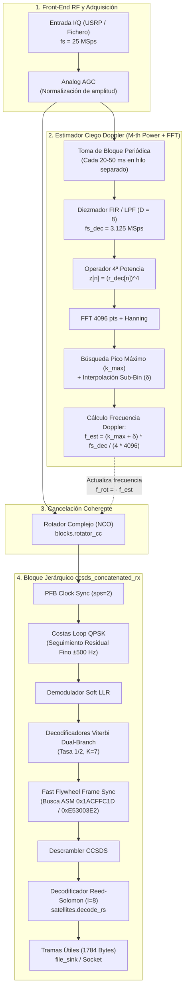

# Algoritmo Ciego de Estimación Doppler por Elevación a la 4ª Potencia y FFT para Enlaces Descendentes CCSDS en Banda X

**Proyecto:** Receptor SDR de Alta Tasa en Banda X (Misión CHESS / CubeSat Pathfinder 0)  
**Estándares de Referencia:** CCSDS 131.0-B-5 (TM Synchronization and Channel Coding), CCSDS 132.0-B-3 (TM Space Data Link Protocol)  
**Fecha:** Septiembre 2026  

---

## 1. Introducción y Motivación Operacional

En enlaces descendentes de satélites en órbita baja (LEO) operando en banda X ($f_0 \approx 8.4\text{ GHz} - 10.475\text{ GHz}$), la alta velocidad relativa entre la plataforma y la estación terrena introduce un desplazamiento Doppler dinámico que puede alcanzar hasta $\Delta f_D \approx \pm 250\text{ kHz}$ con una tasa de variación de hasta $|\dot{f}_D| \approx 2 - 3\text{ kHz/s}$ en el cenit. A esto se suman las incertidumbres térmicas del oscilador local (LO) del satélite y del Low Noise Block (LNB) de la estación, que añaden desviaciones estáticas de hasta $\pm 30\text{ a }50\text{ kHz}$.

Los lazos de recuperación de portadora clásicos en receptores digitales (como el **Costas Loop** de 4º orden para QPSK) poseen un ancho de banda de lazo estrecho ($B_L \ll R_{sym}$) para mantener el ruido de fase y la degradación por jitter a niveles mínimos. Como consecuencia, su **rango de captura** (*pull-in range*) está confinado a un orden de magnitud de pocos cientos de hercios o kilohercios. Si la frecuencia recibida se desvía más allá de este rango, el lazo de Costas es incapaz de enganchar (*false lock* o giro infinito de fase).

Para solventar esta limitación sin depender de efemérides orbitales externas (TLEs) ni de programas auxiliares (como Gpredict), se requiere una etapa de **estimación gruesa de frecuencia no asistida por datos** (*Non-Data-Aided / Blind Coarse Frequency Estimation*). Entre los algoritmos disponibles, la técnica de **no linealidad de potencia $M$ acoplada a un discriminador espectral por Transformada Rápida de Fourier ($M$-th Power + FFT)**, originalmente conceptualizada por Viterbi & Viterbi (1983) y Rife & Boorstyn (1974), constituye el estándar óptimo por su máxima verosimilitud (ML) y elevada ganancia de integración coherente.

---

## 2. Estructura de la Trama y Modulación CCSDS

El estándar CCSDS 131.0-B-5 especifica una arquitectura de transmisión en capas basada en la concatenación de códigos y la estructuración en Unidades de Datos de Acceso al Canal (**CADU** - *Channel Access Data Unit*).

### 2.1. Formato de Trama CADU ($I=8$)
Para una profundidad de entrelazado $I=8$, la estructura temporal de la transmisión se desglosa como sigue:

```
+-----------------------------------------------------------------------------------+
|                            CADU (Channel Access Data Unit)                        |
+-------------------+---------------------------------------------------------------+
|   ASM (32 bits)   |                 Transfer Frame Codificado                     |
|    0x1ACFFC1D     |   Reed-Solomon RS(255, 223) con Entrelazado I=8 (2040 Bytes)  |
|     (4 Bytes)     |              [ 1784 Bytes Info + 256 Bytes Paridad ]          |
+-------------------+---------------------------------------------------------------+
| <--- 32 bits ---> | <------------------------ 16320 bits -----------------------> |
```

1. **Datos de Información Útil ($1784\text{ Bytes}$):**
   - Corresponde a $8$ bloques de datos de $223\text{ bytes}$ cada uno: $8 \times 223 = 1784\text{ bytes}$.
   - Incluye el encabezado primario CCSDS (6 bytes con SCID, VCID, contadores MCFC/VCFC), la carga útil y el CRC-16 terminal.
2. **Codificación Reed-Solomon RS(255, 223):**
   - Se generan $32\text{ bytes}$ de paridad por cada bloque de $223\text{ bytes}$, resultando en bloques codeword de $255\text{ bytes}$.
   - Con entrelazado de profundidad $I=8$: $8 \times 255 = 2040\text{ bytes} = 16320\text{ bits}$.
   - Capacidad correctora: $t = 16\text{ bytes erróneos}$ por codeword ($16 \times 8 = 128\text{ bytes}$ ráfaga con $I=8$).
3. **Pseudo-Aleatorización (Scrambling):**
   - El bloque de $16320\text{ bits}$ se multiplica (XOR) con la secuencia pseudoaleatoria CCSDS generada por el polinomio $h(x) = x^8 + x^7 + x^5 + x^3 + 1$. Esto garantiza suficiente densidad de transiciones para el recuperador de timing y evita picos de densidad espectral.
4. **Marcador de Sincronismo Adjunto (ASM - Attached Sync Marker):**
   - Un patrón invariable de 32 bits prefijado a cada trama codificada:
     $$\text{ASM} = \mathtt{0x1ACFFC1D} = (0001\,1010\,1100\,1111\,1111\,1100\,0001\,1101)_2$$
   - En sistemas con ambigüedad de fase de 90° (QPSK), el receptor evalúa tanto el ASM nominal como su forma rotada ortogonalmente:
     $$\text{ASM}_{rot} = \mathtt{0xE53003E2}$$
   - El ASM **no se pseudo-aleatoriza**, preservando su propiedad de autocorrelación cuasi-delta.
5. **Codificación Convolucional ($r=1/2$, $K=7$):**
   - El flujo binario compuesto por $[\text{ASM} + \text{RS\_Data}] = 32 + 16320 = 16352\text{ bits}$ entra al codificador convolucional de tasa $1/2$ con polinomios generadores $G_1 = 171_8$ y $G_2 = 133_8$ (con inversión de símbolo en $G_2$ según CCSDS).
   - Genera $16352 \times 2 = 32704\text{ símbolos binarios}$ por trama.
6. **Modulación QPSK y Filtrado RRC:**
   - Mapeo en constelación QPSK: $2\text{ bits} \to 1\text{ símbolo complejo}$, resultando en $N_{sym} = 16352\text{ símbolos}$ por trama CADU.
   - Filtrado de conformación de pulso con filtro de Coseno Alzado Raíz (RRC) con factor de roll-off $\alpha = 0.5$ y sobremuestreo $sps = 2$ muestras por símbolo.

---

## 3. Formulación Matemática del Algoritmo $M$-th Power

### 3.1. Modelo de la Señal Recibida
Consideremos la señal en banda base recibida en tiempo discreto a una tasa de muestreo $f_s = 1/T_s$:

$$r[n] = A[n] \cdot e^{j (2\pi \Delta f_D n T_s + \theta_0)} \cdot d[n] + w[n]$$

donde:
- $A[n]$ es la envolvente de amplitud (estabilizada por el control automático de ganancia AGC, tal que $E[A^2[n]] \approx 2$).
- $\Delta f_D$ es el desplazamiento de frecuencia total desconocido (Doppler macroscópico + offset de LO).
- $\theta_0$ es la fase de portadora inicial arbitraria.
- $w[n]$ es ruido blanco gaussiano aditivo complejo circular (AWGN), $w[n] \sim \mathcal{CN}(0, \sigma_w^2)$.
- $d[n]$ representa la modulación digital QPSK:
  $$d[n] = \sum_{k} s_k \cdot p(n T_s - k T_{sym})$$
  donde $p(t)$ es el pulso conformado RRC convolucionado y $s_k$ son los símbolos transmitidos pertenecientes a la constelación QPSK:
  $$s_k \in \left\{ e^{j \frac{\pi}{4}}, e^{j \frac{3\pi}{4}}, e^{j \frac{5\pi}{4}}, e^{j \frac{7\pi}{4}} \right\} = \left\{ \frac{\pm 1 \pm j}{\sqrt{2}} \right\}$$

La fase de cada símbolo QPSK ideal puede expresarse como:
$$\phi_k = \arg(s_k) = (2m_k + 1) \frac{\pi}{4}, \quad m_k \in \{0, 1, 2, 3\}$$

---

### 3.2. Eliminación de la Modulación por No Linealidad ($M = 4$)
Para eliminar la modulación de información de forma completamente ciega, aplicamos el operador no lineal de potencia $M = 4$ a cada muestra compleja $r[n]$:

$$z[n] = (r[n])^4 = \left( A[n] e^{j (2\pi \Delta f_D n T_s + \theta_0)} d[n] + w[n] \right)^4$$

Expandiendo el binomio mediante el teorema multinomial:
$$z[n] = \underbrace{A^4[n] e^{j 4(2\pi \Delta f_D n T_s + \theta_0)} (d[n])^4}_{\text{Término de Señal } s_4[n]} + \underbrace{\sum_{p=1}^{4} \binom{4}{p} \left( A[n] e^{j(2\pi \Delta f_D n T_s + \theta_0)} d[n] \right)^{4-p} (w[n])^p}_{\text{Término de Ruido Compuesto } \eta[n]}$$

#### Análisis del Término de Señal $s_4[n]$:
En los instantes óptimos de muestreo de símbolo (o considerando el valor medio de la constelación tras filtrado simétrico), evaluamos la cuarta potencia de los símbolos $s_k$:
$$(s_k)^4 = \left( e^{j (2m_k + 1) \frac{\pi}{4}} \right)^4 = e^{j (2m_k + 1) \pi} = e^{j 2\pi m_k} \cdot e^{j \pi} = 1 \cdot (-1) = -1 \quad \forall m_k \in \{0, 1, 2, 3\}$$

Nótese que:
$$\left( \frac{1 + j}{\sqrt{2}} \right)^4 = \left( \frac{2j}{2} \right)^2 = j^2 = -1$$
$$\left( \frac{-1 + j}{\sqrt{2}} \right)^4 = (-j)^2 = -1$$
$$\left( \frac{-1 - j}{\sqrt{2}} \right)^4 = j^2 = -1$$
$$\left( \frac{1 - j}{\sqrt{2}} \right)^4 = (-j)^2 = -1$$

Cualquiera que sea el símbolo transmitido (incluidos tanto los bits de datos como los 32 bits del ASM), **la fase de modulación se cancela idénticamente** y se transforma en una constante determinista:
$$(d[n])^4 \approx K_{pulse} \cdot (-1) = -K_{pulse}$$
donde $K_{pulse}$ es una constante de escala debida a la conformación temporal del pulso.

Por consiguiente, el término de señal se reduce a:
$$s_4[n] = - K \cdot e^{j (2\pi (4\Delta f_D) n T_s + 4\theta_0)}$$

> **Conclusión Fundamental:**  
> La elevación a la cuarta potencia colapsa el espectro continuo de modulación QPSK (cuyo ancho de banda ocupa decenas de megahercios) en una **línea espectral discreta (tono armónico puro)** situada exactamente en la frecuencia cuádruple:
> $$f_{tono} = 4 \cdot \Delta f_D$$

---

### 3.3. Análisis de Ruido y Pérdida por Cuadratura (*Squaring Loss*)
El término de ruido $\eta[n]$ generado en la operación de 4ª potencia no es blanco ni gaussiano, sino que contiene productos cruzados señal $\times$ ruido y ruido $\times$ ruido:
$$\eta[n] = 4 s^3[n] w[n] + 6 s^2[n] w^2[n] + 4 s[n] w^3[n] + w^4[n]$$

La relación señal a ruido equivalente del tono a la salida de la cuarta potencia ($SNR_4$) se degrada respecto a la SNR original de entrada por un factor denominado **Pérdida por Cuadratura** (*Squaring / Quadrupling Loss*, $S_L$):
$$S_L = \frac{SNR_{in}}{SNR_4} \approx 1 + \frac{9}{SNR_{in}} + \frac{6}{SNR_{in}^2} + \frac{1.5}{SNR_{in}^3}$$

Para valores de $SNR_{in} = E_s/N_0$ bajos (e.g., $1 - 4\text{ dB}$), el término dominante es $1/SNR_{in}^3$, lo que eleva notablemente el piso de ruido. Para compensar rigurosamente esta degradación y hacer emerger el tono de $4\Delta f_D$, se recurre a la **ganancia de procesado coherente por integración espectral (FFT)**.

---

## 4. Detección Espectral por FFT e Interpolación Sub-Bin

### 4.1. Transformada Discreta de Fourier y Ganancia de Procesado
Tomamos un bloque de $N_{FFT}$ muestras de la señal no lineal $z[n]$ y aplicamos una ventana de baja dispersión espectral (como Hanning o Blackman-Harris) para minimizar la fuga espectral (*spectral leakage*):
$$z_w[n] = z[n] \cdot w_H[n], \quad n = 0, 1, \dots, N_{FFT}-1$$

Calculamos la DFT mediante el algoritmo FFT:
$$Z[k] = \sum_{n=0}^{N_{FFT}-1} z_w[n] \cdot e^{-j \frac{2\pi}{N_{FFT}} k n}, \quad k = -\frac{N_{FFT}}{2}, \dots, \frac{N_{FFT}}{2} - 1$$

El espectro de potencia viene dado por:
$$P[k] = |Z[k]|^2$$

La ganancia de procesado que la FFT aporta al tono armónico frente al ruido incoherente es:
$$G_{FFT} = 10 \log_{10}(N_{FFT})\text{ [dB]}$$

Para una FFT de longitud $N_{FFT} = 4096$:
$$G_{FFT} = 10 \log_{10}(4096) \approx 36.12\text{ dB}$$

Esta ganancia de más de $36\text{ dB}$ supera holgadamente la pérdida $S_L$, permitiendo que el tono $4\Delta f_D$ sobresalga típicamente entre $10$ y $20\text{ dB}$ por encima del piso de ruido espectral, incluso a $E_b/N_0 = 1.5\text{ dB}$.

El índice del bin espectral de máxima energía se determina mediante:
$$k_{max} = \arg\max_{k} P[k]$$

---

### 4.2. Interpolador Fino Sub-Bin (Algoritmo de Rife-Boorstyn / Jacobsen)
La resolución en frecuencia elemental de la malla FFT es:
$$\Delta f_{bin} = \frac{f_s}{N_{FFT}}$$

Como la frecuencia estimada corresponde a $4\Delta f_D$, la resolución directa sobre la portadora es:
$$\Delta f_{carrier, bin} = \frac{f_s}{4 \cdot N_{FFT}}$$

Para una tasa de muestreo $f_s = 25\text{ MSps}$ y $N_{FFT} = 4096$, la resolución discreta de un solo bin es:
$$\Delta f_{carrier, bin} = \frac{25 \cdot 10^6}{4 \times 4096} = 1525.88\text{ Hz}$$

Dejar un error residual de hasta $\pm 762\text{ Hz}$ puede resultar excesivo para un lazo de Costas de ancho de banda estrecho. Para alcanzar una precisión submúltiplo del hercio sin elevar $N_{FFT}$ a valores astronómicos, aplicamos un **interpolador cuadrático / parabólico de 3 puntos** centrado en $k_{max}$ (Rife & Boorstyn, 1974; Jacobsen & Kootsookos, 2007).

Definiendo las potencias espectrales adyacentes (implementación Rife & Boorstyn corregida sobre potencia $P[k] = |Z[k]|^2$):
$$\alpha = P[k_{max}-1]$$
$$\beta = P[k_{max}]$$
$$\gamma = P[k_{max}+1]$$

El desplazamiento fraccionario sub-bin $\delta \in [-0.5, +0.5]$ se calcula de forma cerrada mediante:
$$\delta = \frac{1}{2} \cdot \frac{\alpha - \gamma}{\alpha - 2\beta + \gamma}$$

Alternativamente, utilizando el estimador de Jacobsen (basado en partes reales de productos complejos, con menor sesgo):
$$\delta_{Jacobsen} = \Re \left\{ \frac{Z[k_{max}-1] - Z[k_{max}+1]}{2 Z[k_{max}] - Z[k_{max}-1] - Z[k_{max}+1]} \right\}$$

El índice de frecuencia fraccionario exacto es:
$$k_{opt} = k_{max} + \delta$$

La frecuencia Doppler gruesa estimada final $\widehat{\Delta f_D}$ es:
$$\widehat{\Delta f_D} = \frac{k_{opt} \cdot f_s}{4 \cdot N_{FFT}}$$

> **Precisión alcanzada:** Con interpolación sub-bin, la varianza del estimador $\sigma_{\Delta f}^2$ se aproxima a la **Cota Modificada de Cramér-Rao (MCRB)**:
> $$\text{MCRB}(\Delta f_D) = \frac{3 f_s^2}{2 \pi^2 \cdot (4)^2 \cdot N_{FFT} (N_{FFT}^2 - 1) \cdot SNR_{eff}} \implies \sigma_{\Delta f} < 20\text{ Hz}$$

---

## 5. Arquitectura e Integración en la Cadena GNU Radio

El siguiente diagrama ilustra cómo se inserta la etapa ciega dentro de la cadena global de recepción, en perfecta sinergia con el bloque jerárquico `ccsds_concatenated_rx` previamente validado:



### Dinámica Operacional y Máquina de Estados:
1. **Fase de Adquisición Inicial:**
   - La FFT calcula la potencia espectral y excluye un margen protector de $\pm 8\text{ bins}$ alrededor del pico para estimar fielmente el suelo de ruido.
   - Si la relación pico-ruido supera el umbral parametrizable `threshold_db` (ej. $1.0\text{ dB}$), el pico se considera válido.
   - La señal llega con un Doppler arbitrario de hasta $\pm 250\text{ kHz}$.
   - El estimador de 4ª potencia computa una FFT sobre un bloque de $4096$ muestras (duración temporal de captura: $1.31\text{ ms}$).
   - En $< 2\text{ ms}$, el algoritmo determina $\widehat{\Delta f_D}$ y sintoniza el rotador `blocks.rotator_cc`.
   - El residuo de frecuencia que entra al *Costas Loop* se reduce inmediatamente a menos de $\pm 50\text{ Hz}$.
2. **Fase de Seguimiento en Pasada (Tracking):**
   - A medida que el satélite avanza sobre la estación, la aceleración Doppler máxima en el cenit ($\approx 2\text{ kHz/s}$) es seguida de forma combinada:
     - El estimador de 4ª potencia actualiza la frecuencia del rotador cada $20\text{ ms}$ ($\Delta f_{step} \approx 40\text{ Hz}$).
     - El *Costas Loop* absorbe de forma continua y suave estos micro-residuos sin perder jamás el enganche de fase.
3. **Sincronismo de Tramas Inalterado:**
   - Al cancelarse el Doppler antes del lazo de Costas, el tren de símbolos llega perfectamente alineado al sincronizador dual branch (`chess_dual_branch_flywheel_sync_0`).
   - El patrón ASM `0x1ACFFC1D` correlaciona en su posición exacta cada 16352 símbolos, manteniendo la máquina de estados en modo `LOCK` con $0$ tramas perdidas.

---

## 6. Dimensionamiento y Parámetros Recomendados para CHESS

A continuación se resumen los parámetros numéricos de diseño para el enlace en banda X de la misión:

| Parámetro de Diseño | Símbolo | Valor Recomendado | Justificación Técnica |
| :--- | :--- | :--- | :--- |
| **Frecuencia de Muestreo Entrada** | $f_s$ | $25.0\text{ MSps}$ | Ancho de banda para QPSK a $12.5\text{ MBaud}$ con $sps=2$. |
| **Factor de Diezmado del Estimador** | $D$ | $8$ | Reduce la tasa de cálculo a $f_{s,dec} = 3.125\text{ MSps}$. Ancho de banda de búsqueda $\pm 1.56\text{ MHz}$ (cubre $\pm 250\text{ kHz}$ Doppler con margen). |
| **Longitud de la FFT** | $N_{FFT}$ | $4096\text{ puntos}$ | Proporciona $36.1\text{ dB}$ de ganancia frente a ruido con un tiempo de cómputo $<0.1\text{ ms}$. |
| **Resolución Nativa FFT** | $\Delta f_{bin}$ | $190.73\text{ Hz}$ | $\frac{3.125\text{ MHz}}{4 \times 4096}$. |
| **Resolución tras Interpolación** | $\sigma_{\Delta f}$ | $< 15\text{ Hz}$ | Mediante el interpolador parabólico de 3 puntos. |
| **Cadencia de Actualización** | $T_{up}$ | $20 - 50\text{ ms}$ | Con $\dot{f}_D = 2\text{ kHz/s}$, la deriva máxima entre actualizaciones es $< 100\text{ Hz}$, absorbible por el Costas. |
| **Consumo de CPU Estimado** | $\text{CPU}$ | $< 1.2\%$ | Al operar sobre un bloque de 4096 muestras sólo 20 veces por segundo en un hilo desacoplado. |

---

## 7. Referencias Bibliográficas

1. **Viterbi, A. J., & Viterbi, A. M. (1983).** *Nonlinear estimation of PSK-modulated carrier phase with application to burst digital transmission*. IEEE Transactions on Information Theory, 29(4), 543–551. [DOI: 10.1109/TIT.1983.1056713](https://doi.org/10.1109/TIT.1983.1056713).
2. **Rife, D. C., & Boorstyn, R. R. (1974).** *Single-tone parameter estimation from discrete-time observations*. IEEE Transactions on Information Theory, 20(5), 591–598. [DOI: 10.1109/TIT.1974.1055282](https://doi.org/10.1109/TIT.1974.1055282).
3. **Morelli, M., & Mengali, U. (1998).** *Feedforward frequency estimation for PSK: a tutorial approach*. European Transactions on Telecommunications, 9(2), 103–116. [DOI: 10.1002/ett.4460090203](https://doi.org/10.1002/ett.4460090203).
4. **Jacobsen, E., & Kootsookos, P. (2007).** *Fast, accurate frequency estimators*. IEEE Signal Processing Magazine, 24(3), 123–125. [DOI: 10.1109/MSP.2007.361611](https://doi.org/10.1109/MSP.2007.361611).
5. **Mengali, U., & D'Andrea, A. N. (1997).** *Synchronization Techniques for Digital Receivers*. Plenum Press, New York. [DOI: 10.1007/978-1-4899-1807-9](https://link.springer.com/book/10.1007/978-1-4899-1807-9).
6. **CCSDS (2021).** *TM Synchronization and Channel Coding*. Recommendation for Space Data System Standards, CCSDS 131.0-B-5, Blue Book.
7. **CCSDS (2020).** *TM Synchronization and Channel Coding—Summary of Concept and Rationale*. Informational Report, CCSDS 130.1-G-3, Green Book.
