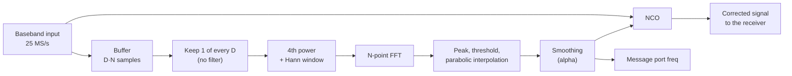

# Blind Doppler Estimation with the M-th Power and FFT

Coarse carrier frequency estimation for a CCSDS 131.0-B-5 QPSK downlink in X-band, as implemented in the `chess.coarse_doppler_sync` block of [gr-chess](https://github.com/DANIEL-PEREIRA-RIQUELME/gr-chess).

**Author:** Daniel Pereira Riquelme, EPFL Spacecraft Team / Telecommunications Circuits Laboratory (TCL), CHESS CubeSat mission (Pathfinder 0)

This note explains why the estimator is needed, how it works, which parameters the flowgraph uses, and what has and has not been verified.

---

## 1. Why a coarse estimator is needed

For a LEO pass at 8.4 GHz the carrier offset seen by the ground station has two parts:

- Orbital Doppler, up to about ±250 kHz, changing at roughly 2.5 kHz/s near zenith.
- Oscillator offsets of the satellite transmitter and the receiver front end, in the order of ±30 to 50 kHz.

A QPSK Costas loop has to use a narrow loop bandwidth to keep phase jitter low, so it can only pull in offsets of a few kilohertz at most. Outside that range it fails to lock or slips cycles. A coarse stage in front of it has to bring the residual offset inside the pull-in range. Doing this blindly, from the signal alone, avoids depending on orbit predictions (TLEs) or a tracking program.

The method is the classic M-th power non-linearity followed by a spectral peak search (Viterbi and Viterbi, 1983; Rife and Boorstyn, 1974; Mengali and D'Andrea, 1997).

---

## 2. Signal model

The received baseband signal, sampled at f_s, is

$$r[n] = A\, e^{j(2\pi \Delta f_D n T_s + \theta_0)}\, d[n] + w[n]$$

- Δf_D is the unknown carrier offset (Doppler plus oscillator offsets) and θ₀ the initial phase.
- w[n] is complex white Gaussian noise.
- d[n] is the shaped QPSK signal, d[n] = Σ_k s_k p(nT_s − kT_sym), with symbols s_k = e^{j(2m_k+1)π/4}, m_k ∈ {0, 1, 2, 3}, and a root-raised-cosine pulse p (α = 0.5, 2 samples per symbol).

The transmitted frame layout (ASM, Reed-Solomon codeword, scrambling, convolutional code) is described in the [README](../README.md). The estimator does not use it: it works on the modulated signal before any decoding.

---

## 3. The M-th power estimator

### 3.1 Removing the modulation

For every QPSK symbol,

$$s_k^4 = e^{j(2m_k+1)\pi} = -1 \quad \text{for all } m_k,$$

so the data cancel when the signal is raised to the 4th power. Ideal, unfiltered symbols would therefore give

$$z[n] = r[n]^4 = -A^4\, e^{j(2\pi\,(4\Delta f_D)\, n T_s + 4\theta_0)} + \text{noise terms},$$

a single tone at **4·Δf_D**. For a BPSK signal the same holds with M = 2.

With pulse shaping the result is not exactly a constant. Between symbol instants the samples of d[n] are combinations of neighbouring symbols, so d[n]⁴ has a non-zero mean, whose size depends on the pulse and on the sampling instant, plus a fluctuating part that behaves as extra noise. The tone is still there, with less power than the ideal case. The estimator does not need its amplitude, only its position.

### 3.2 Noise

Expanding the 4th power of signal plus noise gives, besides the tone, cross terms of the form 4 s³ w, 6 s² w², 4 s w³ and w⁴. The tone-to-noise ratio after the non-linearity is therefore much lower than the input SNR, and the penalty grows quickly as the input SNR drops (the "squaring loss"). I do not give a closed-form value for it here. What matters in practice is that the FFT below recovers part of this loss by integrating the tone coherently.

### 3.3 Peak search

An N-point windowed FFT of z[n] concentrates the tone energy in one bin. Integrating N samples coherently raises the tone above the noise floor by about 10·log₁₀(N) dB relative to a single sample. For N = 16384 this is 42.1 dB; this is a gain over the single-sample ratio, not a guarantee of any absolute margin, which depends on the SNR at the input.

Because the tone sits at 4·Δf_D, a bin of the FFT corresponds to a carrier offset of one quarter of its width in frequency:

$$\Delta f_{\text{bin}} = \frac{f_{\text{eff}}}{M\, N}, \qquad f_{\text{eff}} = \frac{f_s}{D}$$

where D is the decimation factor applied before the non-linearity.

### 3.4 Sub-bin interpolation

The block refines the peak with a 3-point parabolic interpolation on the power spectrum P[k] = |Z[k]|²:

$$\delta = \frac{1}{2}\,\frac{P[k_{\max}-1] - P[k_{\max}+1]}{P[k_{\max}-1] - 2P[k_{\max}] + P[k_{\max}+1]}, \qquad \delta \in [-0.5, 0.5]$$

$$\widehat{\Delta f_D} = \frac{(k_{\max} + \delta)\, f_{\text{eff}}}{M\, N}$$

This is a quadratic interpolation of the kind analysed by Rife and Boorstyn. It is not the Jacobsen estimator, which works on the complex FFT bins instead of the power. The parabolic estimate carries a small bias that depends on the window and on the true position between bins.

### 3.5 From estimate to correction

After each estimate the block:

1. Compares the peak with the average power outside ±8 bins of it, and ignores the estimate if the ratio is below `threshold_db`.
2. Smooths it with a first-order filter, f̂ ← (1 − α)·f̂ + α·f_new.
3. Updates a numerically controlled oscillator running at the full sample rate that multiplies the signal by e^{−j2π f̂ n / f_s}.
4. Publishes f̂ on the `freq` message port as `("freq_hz", value)`.

---

## 4. Parameters used in the flowgraph

| Parameter | Value | Note |
| :--- | :--- | :--- |
| Sample rate f_s | 25 MS/s | 12.5 MBd QPSK at 2 samples per symbol |
| Decimation D | 8 | f_eff = 3.125 MS/s |
| FFT size N | 16384 | Buffer of D·N = 131,072 input samples (5.24 ms) |
| Update interval | 131,072 samples | One estimate per full buffer, about every 5.2 ms |
| Order M | 4 | QPSK |
| Smoothing α | 0.7 | |
| Detection threshold | 1.0 dB | |
| Bin width, tone domain | 190.7 Hz | f_eff / N |
| Bin width, carrier domain | 47.7 Hz | f_eff / (M·N) |
| Unambiguous range | ±390 kHz | \|4·Δf_D\| < f_eff / 2 |
| Coherent gain | 42.1 dB | 10·log₁₀(N) |

The unambiguous range covers the ±250 kHz Doppler plus the oscillator offsets. With a drift of 2.5 kHz/s, the offset changes by about 13 Hz during one 5.2 ms buffer, well below the 47.7 Hz bin width.

The corrected signal then goes to the hierarchical receiver: polyphase timing recovery, Costas loop for the residual offset, soft demapping and Viterbi decoding, frame synchronization, descrambling and Reed-Solomon decoding.

---

## 5. Limitations

- **No anti-aliasing filter before decimation.** The block keeps one of every D samples. Signal and noise outside ±f_eff/2 fold into the analysed band. A 12.5 MBd signal with α = 0.5 is about 18 MHz wide, much more than the 3.125 MHz of f_eff, so a lot of out-of-band power aliases into the FFT. The tone at 4·Δf_D still appears, but the tone-to-noise ratio is lower than with a filtered decimator. I have not measured how much is lost.
- **Estimation accuracy is not characterised.** I have no measurement of the estimator's error versus E_b/N₀ or drift rate, and I do not compare it to the Cramér-Rao bound. The bin width above is what the algorithm resolves without interpolation; the accuracy after interpolation and smoothing has not been quantified.
- **Piecewise-constant correction.** The frequency is updated once per buffer and applied as a constant until the next update, so it lags the drift by up to one buffer.
- **Simulation only.** The results in the [README](../README.md) come from the simulated channel of `chess.downlink_channel`. The estimator has not been run on a recording of a real satellite signal.

---

## References

1. A. J. Viterbi and A. M. Viterbi, "Nonlinear estimation of PSK-modulated carrier phase with application to burst digital transmission," *IEEE Trans. Inf. Theory*, vol. 29, no. 4, pp. 543–551, 1983. doi:10.1109/TIT.1983.1056713
2. D. C. Rife and R. R. Boorstyn, "Single-tone parameter estimation from discrete-time observations," *IEEE Trans. Inf. Theory*, vol. 20, no. 5, pp. 591–598, 1974. doi:10.1109/TIT.1974.1055282
3. E. Jacobsen and P. Kootsookos, "Fast, accurate frequency estimators," *IEEE Signal Process. Mag.*, vol. 24, no. 3, pp. 123–125, 2007. doi:10.1109/MSP.2007.361611
4. U. Mengali and A. N. D'Andrea, *Synchronization Techniques for Digital Receivers*, Plenum Press, 1997.
5. CCSDS, *TM Synchronization and Channel Coding*, CCSDS 131.0-B-5, Blue Book, Issue 5.
