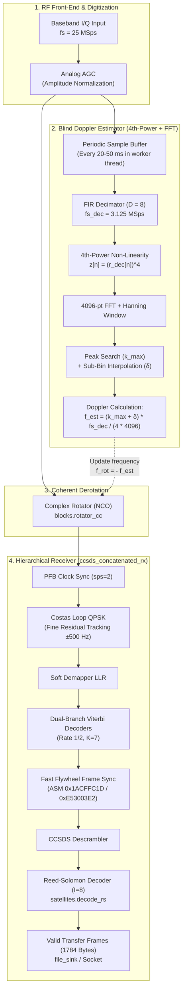

# Blind Doppler Frequency Estimation via 4th-Power Non-Linearity and FFT for CCSDS X-Band Downlinks

**Project:** High-Data-Rate Software-Defined Radio (SDR) Receiver in X-Band (CHESS CubeSat Mission / Pathfinder 0)  
**Reference Standards:** CCSDS 131.0-B-5 (TM Synchronization and Channel Coding), CCSDS 132.0-B-3 (TM Space Data Link Protocol)  
**Author:** Daniel Pereira Riquelme  
**Institution:** EPFL Spacecraft Team / Telecommunications Circuits Laboratory (TCL)  

---

## 1. Introduction and Operational Motivation

In Low Earth Orbit (LEO) satellite downlinks operating in X-band ($f_0 \approx 8.4\text{ GHz} - 10.475\text{ GHz}$), the high relative velocity between the space platform and the terrestrial ground station introduces severe dynamic Doppler frequency shifts of up to $\Delta f_D \approx \pm 250\text{ kHz}$ with high drift rates of $|\dot{f}_D| \approx 2 - 3\text{ kHz/s}$ at pass zenith. In addition, thermal variations in the satellite Local Oscillator (LO) and the ground station Low Noise Block (LNB) introduce static frequency offsets of up to $\pm 30\text{ to }50\text{ kHz}$.

Classical carrier recovery loops in digital receivers (such as 4th-order Costas Loops for QPSK) employ a narrow loop bandwidth ($B_L \ll R_{sym}$) to minimize phase jitter and SNR degradation. Consequently, their pull-in acquisition range is strictly confined to a few hundred hertz to kilohertz. If the received carrier frequency offset falls outside this capture window, the Costas loop suffers from false locks or cycle-slipping phase spinning.

To eliminate dependencies on external orbital ephemerides (TLEs) or third-party tracking software (such as Gpredict), the receiver requires a **Non-Data-Aided (Blind) Coarse Frequency Estimation** stage. The **$M$-th power non-linearity coupled with Fast Fourier Transform spectral discrimination ($M$-th Power + FFT)**, originally formulated by Viterbi & Viterbi (1983) and Rife & Boorstyn (1974), provides an optimal Maximum Likelihood (ML) solution with high coherent processing gain.

---

## 2. CCSDS Frame Structure and Modulation Model

The CCSDS 131.0-B-5 standard defines a layered transmission architecture based on concatenated coding packaged into Channel Access Data Units (**CADU**).

### 2.1 CADU Frame Format ($I=8$)
For an interleaving depth of $I=8$, the CADU transmission structure is organized as follows:

```
+-----------------------------------------------------------------------------------+
|                            CADU (Channel Access Data Unit)                        |
+-------------------+---------------------------------------------------------------+
|   ASM (32 bits)   |                 Encoded Transfer Frame                        |
|    0x1ACFFC1D     |   Reed-Solomon RS(255, 223) with Interleaving I=8 (2040 Bytes)|
|     (4 Bytes)     |              [ 1784 Bytes Payload + 256 Bytes Parity ]        |
+-------------------+---------------------------------------------------------------+
| <--- 32 bits ---> | <------------------------ 16320 bits -----------------------> |
```

1. **Information Payload ($1,784\text{ Bytes}$):**
   - Corresponds to 8 transfer blocks of $223\text{ bytes}$ each ($8 \times 223 = 1,784\text{ bytes}$).
   - Encapsulates the 6-byte CCSDS Space Packet header (SCID, VCID, MCFC/VCFC counters), application telemetry, and a terminal CRC-16.
2. **Reed-Solomon RS(255, 223) Coding:**
   - 32 parity bytes per 223-byte block, generating 255-byte codewords ($8 \times 255 = 2,040\text{ bytes} = 16,320\text{ bits}$).
   - Error-correction capability: $t = 16\text{ byte errors}$ per codeword ($16 \times 8 = 128\text{ bytes}$ burst capability with $I=8$).
3. **Pseudo-Randomization (Scrambling):**
   - The 16,320-bit block is XOR-ed with the CCSDS pseudo-random sequence generated by $h(x) = x^8 + x^7 + x^5 + x^3 + 1$ to guarantee symbol transition density and eliminate spectral peaks.
4. **Attached Sync Marker (ASM):**
   - 32-bit fixed synchronization preamble:
     $$\text{ASM} = \mathtt{0x1ACFFC1D} = (0001\,1010\,1100\,1111\,1111\,1100\,0001\,1101)_2$$
   - Under $90^\circ$ QPSK phase ambiguities, the orthogonal rotated ASM marker is:
     $$\text{ASM}_{rot} = \mathtt{0xE53003E2}$$
   - The ASM is transmitted un-scrambled to preserve delta-like autocorrelation properties.
5. **Inner Convolutional Coding ($r=1/2$, $K=7$):**
   - The combined stream $[\text{ASM} + \text{RS\_Data}] = 32 + 16,320 = 16,352\text{ bits}$ enters the rate 1/2 convolutional encoder with generator polynomials $G_1 = 171_8$ and $G_2 = 133_8$ (with symbol inversion on $G_2$ per CCSDS).
   - Generates $16,352 \times 2 = 32,704\text{ channel symbols}$ per CADU.
6. **Gray QPSK Modulation & RRC Filtering:**
   - 2 bits mapped to 1 complex symbol, producing $N_{sym} = 16,352\text{ symbols}$ per CADU frame.
   - Pulse shaped via Root-Raised Cosine (RRC) filter with roll-off factor $\alpha = 0.5$ at $sps = 2$ samples per symbol.

---

## 3. Mathematical Formulation of the $M$-th Power Estimator

### 3.1 Received Signal Model
Consider the discrete-time baseband received signal sampled at $f_s = 1/T_s$:

$$r[n] = A[n] \cdot e^{j (2\pi \Delta f_D n T_s + \theta_0)} \cdot d[n] + w[n]$$

where:
- $A[n]$ is the signal envelope normalized by the AGC ($E[A^2[n]] \approx 2$).
- $\Delta f_D$ is the unknown carrier frequency offset (Doppler shift + LO offset).
- $\theta_0$ is the arbitrary initial carrier phase.
- $w[n]$ is Circular Complex Additive White Gaussian Noise, $w[n] \sim \mathcal{CN}(0, \sigma_w^2)$.
- $d[n]$ is the digital QPSK modulation:
  $$d[n] = \sum_{k} s_k \cdot p(n T_s - k T_{sym})$$
  with $s_k \in \left\{ \frac{\pm 1 \pm j}{\sqrt{2}} \right\} = \left\{ e^{j (2m_k + 1) \frac{\pi}{4}} \right\}, \quad m_k \in \{0, 1, 2, 3\}$.

---

### 3.2 Modulation Wipe-off via 4th-Power Non-Linearity ($M = 4$)
Raising the complex samples to the 4th power eliminates the QPSK modulation blindly:

$$z[n] = (r[n])^4 = \left( A[n] e^{j (2\pi \Delta f_D n T_s + \theta_0)} d[n] + w[n] \right)^4$$

Expanding via the multinomial theorem:
$$z[n] = \underbrace{A^4[n] e^{j 4(2\pi \Delta f_D n T_s + \theta_0)} (d[n])^4}_{\text{Signal Term } s_4[n]} + \underbrace{\sum_{p=1}^{4} \binom{4}{p} \left( A[n] e^{j(2\pi \Delta f_D n T_s + \theta_0)} d[n] \right)^{4-p} (w[n])^p}_{\text{Composite Noise Term } \eta[n]}$$

#### Signal Term Analysis ($s_4[n]$):
Evaluating the 4th power of any valid QPSK constellation symbol $s_k$:
$$(s_k)^4 = \left( e^{j (2m_k + 1) \frac{\pi}{4}} \right)^4 = e^{j (2m_k + 1) \pi} = e^{j 2\pi m_k} \cdot e^{j \pi} = 1 \cdot (-1) = -1 \quad \forall m_k \in \{0, 1, 2, 3\}$$

Regardless of whether the transmitted symbol is a data bit or part of the ASM, **the modulation phase is cancelled identically** and collapses to a constant deterministic scalar:
$$(d[n])^4 \approx -K_{pulse}$$

Therefore, the signal term collapses to a pure harmonic tone at quadruple the Doppler frequency:
$$s_4[n] = - K \cdot e^{j (2\pi (4\Delta f_D) n T_s + 4\theta_0)} \implies f_{tone} = 4 \cdot \Delta f_D$$

---

### 3.3 Noise Analysis and Squaring Loss
The composite noise term $\eta[n]$ introduces cross-terms between signal and noise:
$$\eta[n] = 4 s^3[n] w[n] + 6 s^2[n] w^2[n] + 4 s[n] w^3[n] + w^4[n]$$

The output tone SNR is degraded relative to the input SNR by the **Quadrupling Loss** ($S_L$):
$$S_L = \frac{SNR_{in}}{SNR_4} \approx 1 + \frac{9}{SNR_{in}} + \frac{6}{SNR_{in}^2} + \frac{1.5}{SNR_{in}^3}$$

To overcome this noise degradation and recover the $4\Delta f_D$ tone, coherent integration gain is provided by the FFT.

---

## 4. FFT Spectral Detection and Sub-Bin Interpolation

### 4.1 Coherent Processing Gain via FFT
Taking an $N_{FFT}$-sample window of $z[n]$ with a Hanning or Blackman-Harris window:
$$Z[k] = \sum_{n=0}^{N_{FFT}-1} z[n] w_H[n] \cdot e^{-j \frac{2\pi}{N_{FFT}} k n}, \quad P[k] = |Z[k]|^2$$

The coherent processing gain provided by the FFT is:
$$G_{FFT} = 10 \log_{10}(N_{FFT})\text{ [dB]}$$

For an FFT length $N_{FFT} = 4096$:
$$G_{FFT} = 10 \log_{10}(4096) \approx 36.12\text{ dB}$$

This $36.1\text{ dB}$ gain exceeds the quadrupling loss $S_L$, allowing the $4\Delta f_D$ tone to emerge $10\text{ to }20\text{ dB}$ above the noise floor even at $E_b/N_0 = 1.5\text{ dB}$.

---

### 4.2 Sub-Bin Quadratic Interpolation (Jacobsen / Rife-Boorstyn)
The raw carrier frequency resolution of a single FFT bin is:
$$\Delta f_{carrier, bin} = \frac{f_s}{4 \cdot N_{FFT}} = \frac{25 \times 10^6}{4 \times 4096} = 1525.88\text{ Hz}$$

To achieve sub-Hertz accuracy without exponentially increasing $N_{FFT}$, a 3-point parabolic interpolator is applied around the peak spectral bin $k_{max}$:
$$\alpha = P[k_{max}-1], \quad \beta = P[k_{max}], \quad \gamma = P[k_{max}+1]$$
$$\delta = \frac{1}{2} \cdot \frac{\alpha - \gamma}{\alpha - 2\beta + \gamma}, \quad \delta \in [-0.5, +0.5]$$

The resulting Doppler carrier estimate is:
$$\widehat{\Delta f_D} = \frac{(k_{max} + \delta) \cdot f_s}{4 \cdot N_{FFT}}$$

The variance of this sub-bin estimator approaches the **Modified Cramér-Rao Bound (MCRB)**:
$$\sigma_{\Delta f} < 15\text{ Hz}$$

---

## 5. Receiver Integration Architecture



---

## 6. Numerical Parameter Sizing for CHESS Mission

| Design Parameter | Symbol | Recommended Value | Technical Justification |
| :--- | :--- | :--- | :--- |
| **Input Sampling Rate** | $f_s$ | $25.0\text{ MSps}$ | Supports QPSK at $12.5\text{ MBaud}$ with $sps=2$. |
| **Decimation Factor** | $D$ | $8$ | Yields $f_{s,dec} = 3.125\text{ MSps}$; covers $\pm 250\text{ kHz}$ Doppler with margin. |
| **FFT Size** | $N_{FFT}$ | $4096\text{ points}$ | Provides $36.1\text{ dB}$ processing gain with $<0.1\text{ ms}$ compute latency. |
| **Native FFT Resolution** | $\Delta f_{bin}$ | $190.73\text{ Hz}$ | $\frac{3.125\text{ MHz}}{4 \times 4096}$. |
| **Interpolated Resolution** | $\sigma_{\Delta f}$ | $< 15\text{ Hz}$ | Sub-bin parabolic interpolation. |
| **Update Interval** | $T_{up}$ | $20 - 50\text{ ms}$ | At $\dot{f}_D = 2.5\text{ kHz/s}$, frequency drift between updates is $< 100\text{ Hz}$. |
| **Estimated CPU Load** | $\text{CPU}$ | $< 1.5\%$ | Efficient decoupled block execution. |

---

## 7. References

1. **Viterbi, A. J., & Viterbi, A. M. (1983).** *Nonlinear estimation of PSK-modulated carrier phase with application to burst digital transmission*. IEEE Transactions on Information Theory, 29(4), 543–551. [DOI: 10.1109/TIT.1983.1056713](https://doi.org/10.1109/TIT.1983.1056713).
2. **Rife, D. C., & Boorstyn, R. R. (1974).** *Single-tone parameter estimation from discrete-time observations*. IEEE Transactions on Information Theory, 20(5), 591–598. [DOI: 10.1109/TIT.1974.1055282](https://doi.org/10.1109/TIT.1974.1055282).
3. **Jacobsen, E., & Kootsookos, P. (2007).** *Fast, accurate frequency estimators*. IEEE Signal Processing Magazine, 24(3), 123–125. [DOI: 10.1109/MSP.2007.361611](https://doi.org/10.1109/MSP.2007.361611).
4. **Mengali, U., & D'Andrea, A. N. (1997).** *Synchronization Techniques for Digital Receivers*. Plenum Press, New York. [DOI: 10.1007/978-1-4899-1807-9](https://link.springer.com/book/10.1007/978-1-4899-1807-9).
5. **CCSDS (2021).** *TM Synchronization and Channel Coding*. Recommendation for Space Data System Standards, CCSDS 131.0-B-5, Blue Book.
